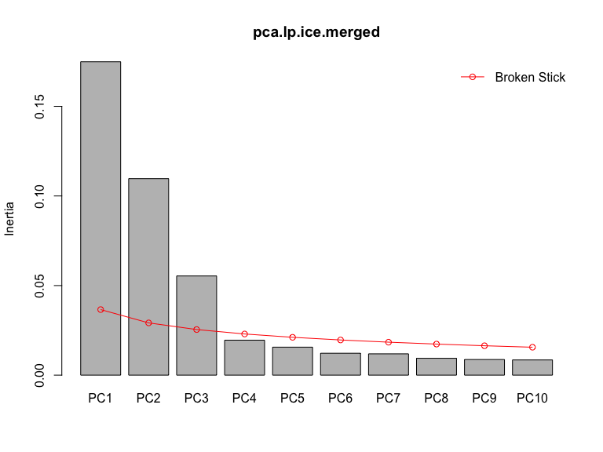
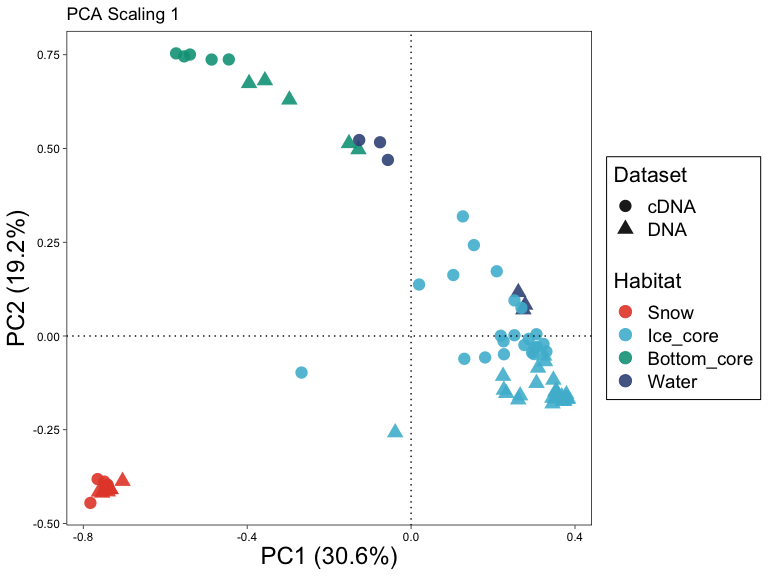
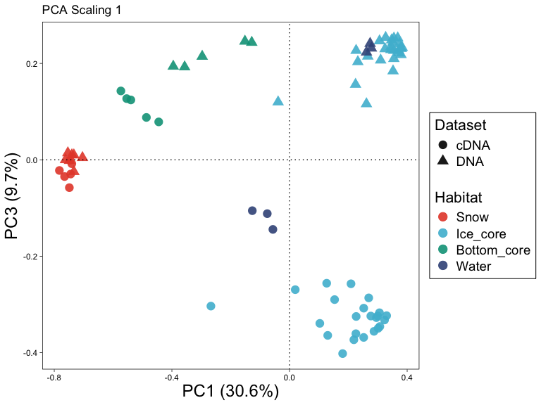

Reproducible code for ‘Chemolithoautotrophic bacteria flourish at dark
water-ice interfaces of an emerged Arctic cold seep’
================
Lisa-Marie Delpech
2023-09-12

- [Documentation](#documentation)
- [0-Source functions](#0-source-functions)
  - [0.1-Packages](#01-packages)
  - [0.2-Internal functions](#02-internal-functions)
- [1-Data wrangling](#1-data-wrangling)
  - [1.1-Sequence processing pipeline](#11-sequence-processing-pipeline)
  - [1.2-Import data in R and parse
    taxonomy](#12-import-data-in-r-and-parse-taxonomy)
  - [1.3-Data wrangling](#13-data-wrangling)
    - [1.3.1-Remove control sequences](#131-remove-control-sequences)
    - [1.3.2-Format column names](#132-format-column-names)
    - [1.3.4-Remove singletons](#134-remove-singletons)
  - [1.4-Rarefaction](#14-rarefaction)
    - [1.4.1-Library sizes](#141-library-sizes)
    - [1.4.2-Rarefaction curves](#142-rarefaction-curves)
    - [1.4.3-Import in `phyloseq`](#143-import-in-phyloseq)
    - [1.4.4-Rarefy to even depth](#144-rarefy-to-even-depth)
  - [1.5-Add sample metadata](#15-add-sample-metadata)
- [2-Beta diversity and 16S counts: **Figure
  1A**](#2-beta-diversity-and-16s-counts-figure-1a)
  - [2.1-Test group differences (**Supplementary
    Information**)](#21-test-group-differences-supplementary-information)
    - [2.1.1-DNA](#211-dna)
    - [2.1.2-cDNA](#212-cdna)
  - [2.2-Ordination (**Figure 1A**)](#22-ordination-figure-1a)
    - [2.2.1-Rarefaction of a combined DNA/cDNA dataset to compare beta
      diversity](#221-rarefaction-of-a-combined-dnacdna-dataset-to-compare-beta-diversity)
    - [2.2.2-16S rRNA gene quantification with qPCR
      data](#222-16s-rrna-gene-quantification-with-qpcr-data)
    - [2.2.3-PCA: **Figure 1A**](#223-pca-figure-1a)
  - [2.3-16S rRNA gene count statistics (**Supplementary
    Information**)](#23-16s-rrna-gene-count-statistics-supplementary-information)
- [3-Alpha diversity: **Figure 1B**](#3-alpha-diversity-figure-1b)
  - [3.1-Compute alpha diversity for both
    datasets](#31-compute-alpha-diversity-for-both-datasets)
  - [3.2-Test for group differences in alpha
    diversity](#32-test-for-group-differences-in-alpha-diversity)
  - [3.3-Plot alpha diversity (**Figure
    1B**)](#33-plot-alpha-diversity-figure-1b)
- [4-Taxonomic composition: **Figure
  1C**](#4-taxonomic-composition-figure-1c)
  - [4.1-Transform sample counts](#41-transform-sample-counts)
  - [4.2-Taxonomy color dataframe](#42-taxonomy-color-dataframe)
  - [4.3-Taxonomy barplot (**Figure
    1C**)](#43-taxonomy-barplot-figure-1c)
  - [4.4-Chloroplast reads (**Figure
    1C**)](#44-chloroplast-reads-figure-1c)
  - [4.5-Cyanobacterial abundance (**Supplementary
    Information**)](#45-cyanobacterial-abundance-supplementary-information)
  - [4.6-Abundance of *Sulfurimonas* and *Thiomicrorhabdus* dominant
    ASVs](#46-abundance-of-sulfurimonas-and-thiomicrorhabdus-dominant-asvs)
  - [4.7-ANME-SRB correlations: **Supplementary
    Information**](#47-anme-srb-correlations-supplementary-information)
    - [4.7.1.-Plot ANME and SEEP-SRB1
      abundances](#471-plot-anme-and-seep-srb1-abundances)
    - [4.7.2.-DNA](#472-dna)
    - [4.7.2.-cDNA](#472-cdna)
  - [4.8-DNA/cDNA discrepancy for SR/SO: **Supplementary
    Information**](#48-dnacdna-discrepancy-for-srso-supplementary-information)

# Documentation

This script aims at reproducing figures and analyses published in the
manuscript “Chemolithoautotrophic bacteria flourish at dark water-ice
interfaces of an emerged Arctic cold seep” \<\>. It takes as input the
published ASV table \<\>, output from the DADA2 pipeline. Alternatively,
the DADA2 pipeline is given, and the raw sequences cam be downloaded
from the NCBI SRA database, accession numbers SRR24977479-SRR24977560.

Section 0 provides internal functions run in the script with their
documentation. The first section wrangles data, removing contaminant
sequences and unwanted lineages, adding sample information to `phyloseq`
objects, and performing rarefaction for the following analyses.

The second section examines diversity and reproduces **Figure 1A** of
the manuscript (beta diversity), the third section reproduces **Figure
1B** (alpha diversity), and the fourth section examines taxonomic
composition and reproduces **Figure 1C**. Numbers and stats presented in
the Brief Report and its **Supplementary Information** are also given.

Built with R 4.4.1.

# 0-Source functions

## 0.1-Packages

``` r
require(tidyverse)
require(ggsci)
require(vegan)
require(phyloseq)
require(pairwiseAdonis) # https://github.com/pmartinezarbizu/pairwiseAdonis
require(dunn.test) 
require(pgirmess)
require(multcompView)
```

## 0.2-Internal functions

If using those functions, please cite \<\>.

The `parseAmplicon` function takes as input the path to the main file
created by the pipeline presented below in section 1.1, the ASV table
with their taxonomic affiliation (named in the pipeline
`$name.ASV.taxonomy.txt`). The second input `output_name` is the
denominator to give to the output files. The function splits the table
into an ASV table and a taxonomy table, the taxonomy is parsed, and
unwanted lineages are removed (Eukaryotes or unclassified lineages,
mitochondrial and chloroplast reads).

``` r
parseAmplicon <- function(path, output_name = "ASV"){
  require(tidyverse)
  
  raw0 <- read.table(file = path, header = TRUE, sep = "\t", skip = 1, comment.char = "") %>% 
    rename(OTU.ID = "X.OTU.ID")
  
  # Remove unwanted lineages
  raw0a <- raw0[grep("Bacteria|Archaea", raw0$taxonomy),] # Remove Eukaryotes or unclassified lineages
  raw0b <- raw0a[-grep("[mM]itochondria|[cC]hloroplast", raw0a$taxonomy),]
  
  asv <- raw0b[,-ncol(raw0b)] %>% # remove taxonomy to have only otu abundance table
    remove_rownames() %>% 
    column_to_rownames(var="OTU.ID")
  
  tax0 <- raw0b[,c("OTU.ID","taxonomy")] %>% # subset taxonomy
    remove_rownames()
  
  # Parse taxonomy
  tax <- str_split(tax0$taxonomy, pattern = "; ", simplify = TRUE) %>%
    as.data.frame() %>%
    rename("Domain"="V1",
           "Phylum" = "V2",
           "Class" = "V3",
           "Order" = "V4",
           "Family" = "V5",
           "Genus" = "V6") %>% 
    mutate(across(.cols = everything(), .fns = function(column){
      str_split(column, "\\(", simplify = TRUE) %>%
        as.data.frame() %>%
        pull(V1)
    }))
  
  rownames(tax) <- tax0$OTU.ID
  
  # Write tables to directory
  write.table(asv, paste0(output_name,"_table.txt"), sep = "\t", quote = F)
  write.table(tax, paste0(output_name,"_taxonomy_table.txt"), sep = "\t", quote = F)
}
```

The `plotRarecurves` function takes an ASV table as input and returns a
plot of rarefaction curves. Arguments:  
\* `df` is the ASV table with ASV names as rownames, sample names as
column names.  
\* `col` corresponds to the colors od the curves for each sample. A
vector of length `ncol(df)` containing color names of hexadecimal
colors.  
\* `label` a boolean, should sample labels be plot?

``` r
plotRarecurves <- function(df,col=rep("black",nrow(df)),label=TRUE){
  require(vegan)
  require(ggplot2)
  nSeq <- colSums(df)
  depth <- min(nSeq)
  labels <- setNames(data.frame(matrix(ncol = 3, nrow = ncol(df))), c("x_label", "y_label", "label"))

  plot.Rarecurves <- ggplot() # Initialise the plot
  
  for (i in 1:ncol(df)){    # Add each curve one by one
    x <- seq(0, nSeq[i], 1000) 
    y <- as.vector(rarefy(df[,i],  # Rarefaction of the sample i to the resolution of x     
                          sample = x))
    plot.Rarecurves <- plot.Rarecurves +
      geom_line(data = data.frame(x,y), aes(x = x, y = y),
                color = col[i])
    labels$x_label[i] <- max(x)
    labels$y_label[i] <- max(y)
    labels$label[i] <- colnames(df)[i]
  }
  plot.Rarecurves <- plot.Rarecurves +
    theme_bw() +
    labs(x = "Number of sequences", y = "Number of ASV") +
    geom_vline(xintercept = depth, linetype="dotted", col = "black")
  if(label){
    plot.Rarecurves +
      geom_label(data = labels,
               aes(x = x_label, y = y_label,
                   label = label),
               size = 2,
               label.padding = unit(0.05,"lines"),
               label.r = unit(0.08,"lines"),
               label.size = 0.2)
  } else {
    plot.Rarecurves
  }
}
```

``` r
# Normality
modified_shapiro_test <- function(x){
  result <- shapiro.test(x)
  tibble(
    p.value=result$p.value,
    statistic=result$statistic
  )
}

# Kruskal-Wallis
modified_KW_test <- function(x,g){
  result <- kruskal.test(x,g)
  tibble(
    p.value=result$p.value,
    statistic=result$statistic,
    parameter=result$parameter
  )
}

# PostHoc Dunn's test to test for group differences
modified_dunn_test <- function(x,g,method){
  result <- dunn.test(x,g,method)
  tibble(
    adjusted.p.value=result$P.adjusted,
    comparison=result$comparisons
  )
}
```

Documentation for the `ggPCA` function is provided in the source code.

``` r
source("./R_Functions/ggPCA.R")
```

    ## Loading required package: ggrepel

The `plotAbundance` takes as main input a `phyloseq` object and is able
to return a barplot of the *n* most abundant taxa (ASVs, OTUs, or other
taxonomic ranks). The barplot can be plot at different taxonomic levels
as well.

``` r
#=========Documentation=========
# Author: Lisa-Marie Delpech
# physeq: a phyloseq object with at least otu and taxonomy tables
# x: x axis variable, one of sample_variables(physeq) or default to Sample.
# n: number of taxa to keep, this argument will be passed on to prune_taxa.
# nrank: taxonomic rank associated to n, default to n first OTUs.
# rank: taxonomic rank to display on the bar plot. If other than OTU, the OTU table will be aggregated to #the specified rank.
# taxonomyCol: dataframe specifying colors for particular taxa. It must contain rownames as taxa (same rank #as the rank argument) and a column named "Color" which contains color supported by ggplot (strings, RGB or #hexadecimals). This option also allows to keep the same color code for similar taxa regardless of their #order of appearance in different plots.
# colorPalette: contains the default color palette in case taxonomyCol is default. It only contains 20 #values. It is suggested to used a custom taxonomyCol file in case the number of different taxa in the #chosen rank is above 20. Otherwise, they will appear in grey.
# plot: boolean. If TRUE, the function will plot the output. If FALSE, it will return a list of the #different objects computed by the function: the data used to plot the output, the number of levels relative #to the aesthetic plotted and the taxonomy color palette. This option allows to retrieve the data and #further work on the plot with custom options.
#=======Documentation end=======


plotAbundance <- function(physeq,x = Sample,
                          n=20,nrank="otu",rank=Genus,
                          other=TRUE,
                          taxonomyCol = "default",
                          colorPalette=c("#e45d8f","#61b950","#9856c9","#b0b83c","#5e6ccc","#dc8f2f","#e16ed2","#408952","#b6378e","#53c1a9","#d23f52","#5e95cf","#ce502d","#c58fd1","#728336","#8f558d","#c6a559","#a64c5c","#95632c","#e18975"),
                          plot=TRUE){
  if (nrank == "otu"){
    TopN <- names(sort(taxa_sums(physeq), decreasing=TRUE)[1:n])  # Save n most abundant OTUs # Else aggregate per nrank and take the n most abundant of those
  } else{
    physeq <- tax_glom(physeq, nrank)
    TopN <- names(sort(taxa_sums(physeq), decreasing=TRUE)[1:n])
  }
  
  df.topN <- physeq %>%
    prune_taxa(TopN,.) %>%
    psmelt() %>% # Transform to long format, NB. creates column Sample from rownames
    mutate(across(.cols = where(is.character), .fns = as.factor))
  
  nlevels <- length(levels(df.topN %>% pull({{rank}})))-1 # Remove unclassified bacteria from number of levels

  df <- df.topN %>% 
    mutate("{{rank}}" := factor({{rank}}, c(levels({{rank}})[-grep("Bacteria_unclassified",levels({{rank}}))],"Bacteria_unclassified")))
  
  is.asv <- FALSE
  if (length(levels(df %>% pull({{rank}}))) == 1){
    if (levels(df %>% pull({{rank}})) == c("Bacteria_unclassified")){
      df <- df.topN # Case when rank is OTU
      is.asv <- TRUE
    }
  }
  
  if (other){
  
  df.other <- df.topN %>%
    group_by({{x}}) %>% # Column SampleName for factor order # Later change to Sample and order Sample in the physeq object
    summarize(Abundance = 100-sum(Abundance)) %>%
    as.data.frame() %>% 
    mutate(Domain = factor("Other"),
           Phylum = factor("Other"),
           Class = factor("Other"),
           Order = factor("Other"),
           Family = factor("Other"),
           Genus = factor("Other"),
           OTU = factor("Other")) %>% 
    left_join(sample_data(physeq) %>% data.frame() %>% rownames_to_column(var = "Sample"))# %>% 
    # mutate(Sample = SampleName) # This remains to be parsed to fit any physeq object

  df <- full_join(df.topN,df.other) %>%
    mutate(across(.cols = where(is.character), .fns = as.factor)) %>% 
    mutate("{{rank}}" := factor({{rank}}, c("Other",levels({{rank}})[-grep("Other|Bacteria_unclassified",levels({{rank}}))],"Bacteria_unclassified")))
  }
  
  if (is.data.frame(taxonomyCol)){ # If there is a specific file for taxonomy color make a new color palette, else default palette
  colorPalette <- taxonomyCol %>% 
    rownames_to_column(var = "Taxa") %>% 
    filter(Taxa %in% (df.topN %>% pull({{rank}}))) %>% 
    arrange(Taxa) %>% 
    pull(Color)
  }
  
  plot.abund <- ggplot(data = df,
                 aes(x = {{x}}, y = Abundance, fill = {{rank}})) +
    geom_bar(stat="identity",
             width = 0.9) + #colour = "black"
    labs(fill = element_blank(), y = "Relative Abundance (%)") +
    scale_fill_manual(values = if(other){c("#E6E6E6",colorPalette[1:nlevels],"#5f5f5f")}else{
                        if(is.asv){c(colorPalette[1:(nlevels+1)])}else{c(colorPalette[1:nlevels],"#5f5f5f")}
                      }) +
    theme_bw() +
    theme(axis.text.x = element_text(angle = 90, hjust=1, vjust=0.5),
          panel.grid.major.x = element_blank())
  
  if (plot){
    return(plot.abund)
  } else{
    return(list(data=df,nlevels=nlevels,colorPalette=colorPalette))
  }
}
```

``` r
# Define a function to search for a taxon in a rank of the taxonomy table of a physeq object
searchTaxa <- function(physeq, taxon, rank){
  tax <- physeq %>% 
    tax_table() %>% 
    as.data.frame()
  
  out <- tax[grep(taxon, tax[,rank]),]
  
  return(out)
}

# Function to subset a phyloseq object to desired ASVs
subsetPhyseq <- function(physeq, asv){
  otu_table(physeq) %>% 
  as.data.frame() %>% 
  rownames_to_column(var = "ASV") %>% 
  filter(ASV %in% asv) %>% 
  column_to_rownames(var = "ASV") %>% 
  as.matrix() %>% 
  otu_table(taxa_are_rows = TRUE) %>% 
  phyloseq(., tax_table(physeq), sample_data(physeq))
}
```

# 1-Data wrangling

## 1.1-Sequence processing pipeline

``` bash
#!/usr/bin/env bash

########################################
##           Job environment          ##
########################################

set -o errexit  # Exit the script on any error
set -o nounset  # Treat any unset variables as an error

module --quiet purge  # Reset the modules to the system default
module load QIIME2/2021.8

########################################
##           Execute script           ##
########################################


# Database for taxonomy
REFDIR=/path/to/Silva/Databases/Silva_138/silva.nr_v138_1.align # Downloaded from https://mothur.org/blog/2021/SILVA-v138_1-reference-files/
TAXDIR=/path/to/Silva/Databases/Silva_138/silva.nr_v138_1.tax 


# Variables
cpu=8
name=16S_Bact
taxname=nr_v138.1 # taxonomy database name without the extension
project_home=path/to/project/directory # project_directory


#forward
  #trim left
trimleftf=19 # Primer F-NXT-515F-Y
  #trunc length
trunclenf=270
#reverse
  #trim left
trimleftr=20 # Primer R-NXT-926R
  #trunc length
trunclenr=210


cd  $project_home
mkdir $name.ASV

########################IMPORT IN QIIME2#########################

cd $name.ASV

qiime tools import \
  --type 'SampleData[PairedEndSequencesWithQuality]' \
  --input-path $project_home/pe-33-manifest-Bact.txt \
  --input-format PairedEndFastqManifestPhred33V2 \
  --output-path $name.demux-paired-end.qza

qiime demux summarize \
  --i-data $name.demux-paired-end.qza \
  --o-visualization $name.demux.qzv

##############################DADA2##############################

qiime dada2 denoise-paired \
  --i-demultiplexed-seqs $name.demux-paired-end.qza \
  --p-trim-left-f $trimleftf \
  --p-trim-left-r $trimleftr \
  --p-trunc-len-f $trunclenf \
  --p-trunc-len-r $trunclenr \
  --p-n-threads $cpu \
  --o-table $name.ASV.table.qza \
  --o-representative-sequences $name.ASV.rep-seqs.qza \
  --o-denoising-stats $name.ASV.denoising-stats.qza

###########################EXPORT FILES#########################

qiime tools export \
  --input-path $name.ASV.table.qza \
  --output-path $name.ASV.table
  
qiime tools export \
  --input-path $name.ASV.rep-seqs.qza \
  --output-path $name.ASV.rep-seqs
 
qiime tools export \
  --input-path $name.ASV.denoising-stats.qza \
  --output-path $name.ASV.denoising-stats
  
mkdir $project_home/$name.ASV.results

cp $name.ASV.table/feature-table.biom $project_home/$name.ASV.results/$name.ASV.biom
cp $name.ASV.rep-seqs/dna-sequences.fasta $project_home/$name.ASV.results/$name.ASV.fa
cp $name.ASV.denoising-stats/stats.tsv $project_home/$name.ASV.results/$name.DADA2.stats.tsv

##########################ASSIGN TAXONOMY#######################

cd $project_home/$name.ASV.results

module --quiet purge
module load Mothur/1.43.0-foss-2019a-Python-3.7.2

mothur "#classify.seqs(fasta=$name.ASV.fa, reference=$REFDIR, taxonomy=$TAXDIR, cutoff=75, processors=$cpu)"

module --quiet purge
module load biom-format/2.1.10-foss-2020a-Python-3.8.2

biom add-metadata \
  --sc-separated taxonomy \
  --observation-header OTUID,taxonomy \
  --observation-metadata-fp $name.*.wang.taxonomy \
  -i $name.ASV.biom \
  -o $name.ASV.taxonomy.biom

biom convert \
  -i $name.ASV.taxonomy.biom \
  -o $name.ASV.taxonomy.txt \
  --to-tsv --header-key taxonomy \
  --table-type "OTU table"

exit
```

Inspect DADA2 denoising statistics.

``` r
dada2.stats <- read.table("./16S_2022_Sequencing_data/16S_Bact.DADA2.stats.tsv", sep = "\t", header = TRUE)
```

``` r
# Plot number of reads stats
dada2.stats %>% 
  pivot_longer(cols = !sample.id, values_to = "Stat", names_to = "Step") %>% 
  filter(!grepl('percentage', Step)) %>% 
  mutate(across(.cols = where(is.character), .fns = as.factor)) %>% 
  mutate(Step = factor(Step, c("input", "filtered","denoised","merged","non.chimeric")),
         Dataset = case_when(grepl("cDNA",sample.id) ~ "cDNA",
                             TRUE ~ "DNA")) %>% 
  ggplot(aes(x = Step, y = Stat, fill = Dataset)) +
  geom_boxplot(alpha = .8) +
  geom_jitter(position = position_jitterdodge(jitter.width = 0.1),
              size = 1, alpha = .5) +
  scale_fill_npg() +
  theme_bw() +
  labs(y = "Number of reads") +
  scale_x_discrete(labels = c("Input", "Filtered","Denoised", "Merged","Non chimeric"))
```

<!-- -->

## 1.2-Import data in R and parse taxonomy

``` r
parseAmplicon("./16S_2022_Sequencing_data/16S_Bact.ASV.taxonomy.txt", output_name = "16S_2022_Sequencing_data/ASV")
raw0 <- read.table(file = "./16S_2022_Sequencing_data/16S_Bact.ASV.taxonomy.txt", header = TRUE, sep = "\t", comment.char = "", skip = 1) %>% rename(OTU.ID = "X.OTU.ID")
```

Compute statistics about read counts after each steps of the parsing
steps (removal of unwanted lineages).

``` r
raw0a <- raw0[grep("Bacteria|Archaea", raw0$taxonomy),] # Remove Eukaryotes or unclassified lineages
raw0b <- raw0a[-grep("[mM]itochondria|[cC]hloroplast", raw0a$taxonomy),]

# Chloroplast reads
chloroplasts <- raw0a[grep("[cC]hloroplast", raw0a$taxonomy),]
write.table(chloroplasts, "./16S_2022_Sequencing_data/Chloroplasts.txt", sep = "\t", quote = F)

# Stats about removed lineages
nrow(raw0a)/nrow(raw0)*100 # % of Bacteria|Archaea in ASVs
```

    ## [1] 98.52172

``` r
nrow(raw0b)/nrow(raw0)*100 # % without mitochondria and chloroplasts
```

    ## [1] 97.33451

``` r
bact.arch <- raw0a %>% as_tibble() %>% column_to_rownames(var = "OTU.ID") %>% select(-taxonomy) %>% colSums() %>% 
  as.data.frame() %>% 
  rownames_to_column(var = "sample.id") %>% 
  rename(removed.lineages = ".") %>% 
  mutate(sample.id = str_replace(sample.id, pattern = "\\.", "-"))
  
mit.chl <- raw0b %>% as_tibble() %>% column_to_rownames(var = "OTU.ID") %>% select(-taxonomy) %>% colSums() %>% 
  as.data.frame() %>% 
  rownames_to_column(var = "sample.id") %>% 
  rename(removed.mitochondria.chloroplasts = ".") %>% 
  mutate(sample.id = str_replace(sample.id, pattern = "\\.", "-"))
```

``` r
dada2.stats %>% 
  full_join(bact.arch, by = "sample.id") %>% 
  full_join(mit.chl, by = "sample.id") %>% 
  mutate(percentage.denoised = denoised/input*100,
         percentage.removed.lineages = removed.lineages/input*100,
         percentage.mtch.chl = removed.mitochondria.chloroplasts/input*100,
         percentage.mtch.chl.vs.dada2 = 100-removed.mitochondria.chloroplasts/non.chimeric*100) %>%
  pivot_longer(cols = !sample.id, values_to = "Stat", names_to = "Step") %>% 
  filter(grepl('percentage', Step)) %>% 
  mutate(across(.cols = where(is.character), .fns = as.factor)) %>% 
  mutate(Step = factor(Step, c("percentage.of.input.passed.filter", "percentage.denoised","percentage.of.input.merged","percentage.of.input.non.chimeric","percentage.removed.lineages","percentage.mtch.chl","percentage.mtch.chl.vs.dada2"))) %>% 
  filter(!grepl("NTC|MoComE", sample.id)) %>% 
  mutate(Dataset = case_when(grepl("cDNA",sample.id) ~ "cDNA",
                             TRUE ~ "DNA")) %>% 
  group_by(Dataset, Step) %>% 
  summarize(Mean_percentage_per_sample = mean(Stat))
```

    ## `summarise()` has grouped output by 'Dataset'. You can override using the
    ## `.groups` argument.

    ## # A tibble: 14 × 3
    ## # Groups:   Dataset [2]
    ##    Dataset Step                              Mean_percentage_per_sample
    ##    <chr>   <fct>                                                  <dbl>
    ##  1 DNA     percentage.of.input.passed.filter                     78.4  
    ##  2 DNA     percentage.denoised                                   76.8  
    ##  3 DNA     percentage.of.input.merged                            70.7  
    ##  4 DNA     percentage.of.input.non.chimeric                      67.1  
    ##  5 DNA     percentage.removed.lineages                           66.2  
    ##  6 DNA     percentage.mtch.chl                                   65.6  
    ##  7 DNA     percentage.mtch.chl.vs.dada2                           2.26 
    ##  8 cDNA    percentage.of.input.passed.filter                     77.2  
    ##  9 cDNA    percentage.denoised                                   73.9  
    ## 10 cDNA    percentage.of.input.merged                            64.6  
    ## 11 cDNA    percentage.of.input.non.chimeric                      54.6  
    ## 12 cDNA    percentage.removed.lineages                           54.5  
    ## 13 cDNA    percentage.mtch.chl                                   54.0  
    ## 14 cDNA    percentage.mtch.chl.vs.dada2                           0.886

## 1.3-Data wrangling

Read tables parsed by the `parseAmplicon` function.

``` r
ASV <-  read.table("./16S_2022_Sequencing_data/ASV_table.txt", header = TRUE, sep = "\t", row.names = 1)
tax.ASV <- read.table("./16S_2022_Sequencing_data/ASV_taxonomy_table.txt", header = TRUE, sep = "\t", row.names = 1)
```

Rename ASVs and split DNA and cDNA datasets.

``` r
all.equal(rownames(ASV), rownames(tax.ASV))
```

    ## [1] TRUE

``` r
asv.accnb <- rownames(ASV)
rownames(ASV) <- paste(rep("ASV",length(asv.accnb)),c(1:length(asv.accnb)), sep  = "_")
rownames(tax.ASV) <- rownames(ASV)
index.ASV <- data.frame(ACCN=asv.accnb, ASV=rownames(ASV))
# saveRDS(index.ASV, "./Metadata/index_ASV.rds")

MockComm <- ASV %>% 
  select(contains("MoCom")) # Save Mock community separately  (only for LP_ICE_21)
ASV <- ASV %>% 
  select(-contains("MoCom"))

ASV.DNA <- ASV %>% 
  select(-contains("cDNA")) # Only LP_ICE_21 samples have cDNA sequences
ASV.cDNA <- ASV %>% 
  select(contains("cDNA"))
```

### 1.3.1-Remove control sequences

``` r
# There are two control columns: NTC.Index and NTC.TS (target specific)
length(which(ASV.DNA$LP_ICE_21_NTC.TS_DNA != 0)) # ~27 ASV contaminated
```

    ## [1] 27

``` r
length(which(ASV.DNA$LP_ICE_21_NTC.Index_DNA != 0)) # ~0 ASV contaminated
```

    ## [1] 0

``` r
ASV.DNA.control <- ASV.DNA
ASV.DNA <- ASV.DNA - ASV.DNA.control$LP_ICE_21_NTC.TS_DNA

ASV.DNA[ASV.DNA < 0] <- 0
sum(ASV.DNA)/sum(ASV.DNA.control)*100 # Percentage of DNA sequences retained after NTC DNA sequences removal (95,6%)
```

    ## [1] 95.64843

``` r
length(which(ASV.cDNA$LP_ICE_21_NTC.TS_cDNA != 0)) # 46 ASV contaminated
```

    ## [1] 46

``` r
length(which(ASV.cDNA$LP_ICE_21_NTC.Index_cDNA != 0)) # 0 ASV contaminated
```

    ## [1] 0

``` r
ASV.cDNA.control <- ASV.cDNA
ASV.cDNA <- ASV.cDNA - ASV.cDNA.control$LP_ICE_21_NTC.TS_cDNA

ASV.cDNA[ASV.cDNA < 0] <- 0
sum(ASV.cDNA)/sum(ASV.cDNA.control)*100 # Percentage of sequences retained after NTC cDNA sequences removal (97,9%)
```

    ## [1] 97.89434

``` r
# Now remove NTC columns
ASV.DNA <- ASV.DNA %>% select(-contains("NTC")) # Remove NTC columns
ASV.cDNA <- ASV.cDNA %>% select(-contains("NTC"))
dim(ASV.DNA)
```

    ## [1] 29761    41

``` r
dim(ASV.cDNA)
```

    ## [1] 29761    41

``` r
ASV.DNA.control %>% filter(rowSums(.) == 0) %>% dim() # 10288 empy ASVs
```

    ## [1] 10288    43

``` r
ASV.DNA %>% filter(rowSums(.) == 0) %>% dim() # 10311 empty ASVs (23 more)
```

    ## [1] 10311    41

``` r
ASV.cDNA.control %>% filter(rowSums(.) == 0) %>% dim() # 14983 empy ASVs
```

    ## [1] 14983    43

``` r
ASV.cDNA %>% filter(rowSums(.) == 0) %>% dim() # 15018 empty ASVs (37 more)
```

    ## [1] 15018    41

### 1.3.2-Format column names

``` r
# Rename columns
colnames(ASV.DNA) <- colnames(ASV.DNA) %>% 
  str_split(., "_DNA") %>%
  sapply(., getElement, 1) %>% 
  str_replace(.,"\\.","-")

colnames(ASV.cDNA) <- colnames(ASV.cDNA) %>% 
  str_split(., "_cDNA") %>% 
  sapply(., getElement, 1) %>% 
  str_replace(.,"\\.","-")
```

### 1.3.4-Remove singletons

Exact singletons are considered as ASV that have only one sequence in
one sample.

``` r
singleASV.DNA <- ASV.DNA[rowSums(ASV.DNA)>0,] # Only keep non-empty ASVs
singleASV.cDNA <- ASV.cDNA[rowSums(ASV.cDNA)>0,]

singleASV.DNA[rowSums(singleASV.DNA)==1,] %>% dim() # 112 exact singletons
```

    ## [1] 112  41

``` r
singleASV.cDNA[rowSums(singleASV.cDNA)==1,] %>% dim() # 209 exact singletons
```

    ## [1] 209  41

``` r
ASV.DNA <- ASV.DNA[rowSums(ASV.DNA)>1,] # Remove singletons
dim(ASV.DNA)
```

    ## [1] 19338    41

``` r
hist(colSums(ASV.DNA)/colSums(singleASV.DNA)*100, xlab="% of sequences retained in sample", ylab= "Number of samples", main="Proportion of retained sequences after singleton removal")
```

<!-- -->

``` r
sum(ASV.DNA)/sum(singleASV.DNA) * 100 # 99,998% of sequences retained
```

    ## [1] 99.99767

``` r
ASV.cDNA <- ASV.cDNA[rowSums(ASV.cDNA)>1,] 
dim(ASV.cDNA)
```

    ## [1] 14534    41

``` r
hist(colSums(ASV.cDNA)/colSums(singleASV.cDNA)*100, xlab="% of sequences retained in sample", ylab= "Number of samples", main="Proportion of retained sequences after singleton removal")
```

<!-- -->

``` r
sum(ASV.cDNA)/sum(singleASV.cDNA) * 100 # 99,994% of sequences retained
```

    ## [1] 99.99351

## 1.4-Rarefaction

### 1.4.1-Library sizes

``` r
ASV.DNA %>% colSums(.) %>% summary()
```

    ##    Min. 1st Qu.  Median    Mean 3rd Qu.    Max. 
    ##   39255   97092  119746  117171  135723  197705

``` r
ASV.cDNA %>% colSums(.) %>% summary()
```

    ##    Min. 1st Qu.  Median    Mean 3rd Qu.    Max. 
    ##     533   35268   74050   78519  116486  178379

``` r
ASV.DNA %>% colSums(.) %>% sort()
```

    ##   LP_ICE_21_Core2_10-20   LP_ICE_21_Core3_30-40        LP_ICE_21_Water3 
    ##                   39255                   43205                   74657 
    ##    LP_ICE_21_Core2_0-10        LP_ICE_21_Water1   LP_ICE_21_Core2_20-30 
    ##                   78360                   81415                   88881 
    ##    LP_ICE_21_Core3_0-10   LP_ICE_21_Core2_60-70   LP_ICE_21_Core1_70-80 
    ##                   91695                   94232                   94447 
    ##   LP_ICE_21_Core3_70-80         LP_ICE_21_Snow3        LP_ICE_21_Water2 
    ##                   96492                   97092                   98423 
    ##   LP_ICE_21_Core3_50-60   LP_ICE_21_Core3_40-50         LP_ICE_21_Snow2 
    ##                   99386                  104547                  106920 
    ##   LP_ICE_21_Core1_40-50   LP_ICE_21_Core1_50-60   LP_ICE_21_Core2_50-60 
    ##                  108180                  113593                  115025 
    ##   LP_ICE_21_Core1_30-40         LP_ICE_21_Snow4         LP_ICE_21_Snow7 
    ##                  116706                  117652                  119746 
    ##  LP_ICE_21_Core3_90-100   LP_ICE_21_Core3_60-70   LP_ICE_21_Core1_60-70 
    ##                  119856                  120464                  122261 
    ##   LP_ICE_21_Core3_20-30         LP_ICE_21_Snow1   LP_ICE_21_Core1_20-30 
    ##                  124065                  124601                  125265 
    ##   LP_ICE_21_Core1_10-20   LP_ICE_21_Core2_40-50   LP_ICE_21_Core3_10-20 
    ##                  125411                  133757                  134181 
    ##   LP_ICE_21_Core2_30-40   LP_ICE_21_Core2_70-80         LP_ICE_21_Snow5 
    ##                  135723                  137132                  137465 
    ## LP_ICE_21_Core2_100-110   LP_ICE_21_Core3_80-90         LP_ICE_21_Snow6 
    ##                  140230                  144414                  148899 
    ##   LP_ICE_21_Core2_80-90   LP_ICE_21_Core1_80-90  LP_ICE_21_Core1_90-100 
    ##                  153551                  157255                  170806 
    ##  LP_ICE_21_Core2_90-100    LP_ICE_21_Core1_0-10 
    ##                  171064                  197705

``` r
ASV.cDNA %>% colSums(.) %>% sort()
```

    ##    LP_ICE_21_Core3_0-10         LP_ICE_21_Snow7   LP_ICE_21_Core3_40-50 
    ##                     533                     841                    3779 
    ##    LP_ICE_21_Core1_0-10    LP_ICE_21_Core2_0-10        LP_ICE_21_Water1 
    ##                   15356                   24241                   24463 
    ## LP_ICE_21_Core2_100-110        LP_ICE_21_Water2  LP_ICE_21_Core2_90-100 
    ##                   27740                   31109                   31897 
    ##   LP_ICE_21_Core3_80-90         LP_ICE_21_Snow2  LP_ICE_21_Core1_90-100 
    ##                   34539                   35268                   37841 
    ##        LP_ICE_21_Water3         LP_ICE_21_Snow3         LP_ICE_21_Snow4 
    ##                   41098                   48416                   48529 
    ##   LP_ICE_21_Core2_10-20   LP_ICE_21_Core3_30-40   LP_ICE_21_Core3_50-60 
    ##                   66417                   68613                   68764 
    ##  LP_ICE_21_Core3_90-100   LP_ICE_21_Core2_60-70   LP_ICE_21_Core3_60-70 
    ##                   70089                   71770                   74050 
    ##   LP_ICE_21_Core3_70-80   LP_ICE_21_Core1_60-70         LP_ICE_21_Snow1 
    ##                   75373                   76881                   84978 
    ##   LP_ICE_21_Core1_30-40         LP_ICE_21_Snow6   LP_ICE_21_Core1_80-90 
    ##                   87209                   87359                   94883 
    ##   LP_ICE_21_Core2_80-90   LP_ICE_21_Core2_40-50   LP_ICE_21_Core1_40-50 
    ##                   96778                  103902                  105395 
    ##   LP_ICE_21_Core1_70-80   LP_ICE_21_Core2_70-80   LP_ICE_21_Core3_20-30 
    ##                  116486                  121663                  126939 
    ##   LP_ICE_21_Core3_10-20         LP_ICE_21_Snow5   LP_ICE_21_Core1_10-20 
    ##                  130451                  131460                  136450 
    ##   LP_ICE_21_Core1_20-30   LP_ICE_21_Core2_20-30   LP_ICE_21_Core1_50-60 
    ##                  146066                  152960                  165473 
    ##   LP_ICE_21_Core2_30-40   LP_ICE_21_Core2_50-60 
    ##                  174857                  178379

### 1.4.2-Rarefaction curves

``` r
plotRarecurves(ASV.DNA,label = FALSE) +
  geom_vline(xintercept=39255, linetype="dotted", col = "#4DBBD5") # Min sequence number
```

    ## Warning in rarefy(df[, i], sample = x): most observed count data have counts 1,
    ## but smallest count is 2

<!-- -->

``` r
plotRarecurves(ASV.cDNA, label = TRUE) +
  geom_vline(xintercept=24241, linetype="dotted", col = "red") # 
```

    ## Warning in rarefy(df[, i], sample = x): most observed count data have counts 1,
    ## but smallest count is 2
    ## Warning in rarefy(df[, i], sample = x): most observed count data have counts 1,
    ## but smallest count is 2
    ## Warning in rarefy(df[, i], sample = x): most observed count data have counts 1,
    ## but smallest count is 2
    ## Warning in rarefy(df[, i], sample = x): most observed count data have counts 1,
    ## but smallest count is 2

    ## `geom_line()`: Each group consists of only one observation.
    ## ℹ Do you need to adjust the group aesthetic?
    ## `geom_line()`: Each group consists of only one observation.
    ## ℹ Do you need to adjust the group aesthetic?

<!-- -->

### 1.4.3-Import in `phyloseq`

We will work with `phyloseq` for downstream analyses, as well as for
rarefaction.

``` r
# Create a phyloseq object for each 'dataset'
LP.ICE.DNA <- phyloseq(
  ASV.DNA %>% as.matrix() %>% otu_table(.,taxa_are_rows = TRUE),
  tax.ASV %>% rownames_to_column(var = "ASV") %>% filter(ASV %in% rownames(ASV.DNA)) %>% column_to_rownames(var = "ASV") %>% as.matrix() %>% tax_table(.)
)
LP.ICE.DNA
```

    ## phyloseq-class experiment-level object
    ## otu_table()   OTU Table:         [ 19338 taxa and 41 samples ]
    ## tax_table()   Taxonomy Table:    [ 19338 taxa by 6 taxonomic ranks ]

``` r
LP.ICE.cDNA <- phyloseq(
  ASV.cDNA %>% as.matrix() %>% otu_table(.,taxa_are_rows = TRUE),
  tax.ASV %>% rownames_to_column(var = "ASV") %>% filter(ASV %in% rownames(ASV.cDNA)) %>% column_to_rownames(var = "ASV") %>% as.matrix() %>% tax_table(.)
)
LP.ICE.cDNA
```

    ## phyloseq-class experiment-level object
    ## otu_table()   OTU Table:         [ 14534 taxa and 41 samples ]
    ## tax_table()   Taxonomy Table:    [ 14534 taxa by 6 taxonomic ranks ]

### 1.4.4-Rarefy to even depth

``` r
# Sequencing depth
ASV.DNA %>% colSums(.) %>% sort() # Minimum is 39255: rarefy to minimum sequencing depth
```

    ##   LP_ICE_21_Core2_10-20   LP_ICE_21_Core3_30-40        LP_ICE_21_Water3 
    ##                   39255                   43205                   74657 
    ##    LP_ICE_21_Core2_0-10        LP_ICE_21_Water1   LP_ICE_21_Core2_20-30 
    ##                   78360                   81415                   88881 
    ##    LP_ICE_21_Core3_0-10   LP_ICE_21_Core2_60-70   LP_ICE_21_Core1_70-80 
    ##                   91695                   94232                   94447 
    ##   LP_ICE_21_Core3_70-80         LP_ICE_21_Snow3        LP_ICE_21_Water2 
    ##                   96492                   97092                   98423 
    ##   LP_ICE_21_Core3_50-60   LP_ICE_21_Core3_40-50         LP_ICE_21_Snow2 
    ##                   99386                  104547                  106920 
    ##   LP_ICE_21_Core1_40-50   LP_ICE_21_Core1_50-60   LP_ICE_21_Core2_50-60 
    ##                  108180                  113593                  115025 
    ##   LP_ICE_21_Core1_30-40         LP_ICE_21_Snow4         LP_ICE_21_Snow7 
    ##                  116706                  117652                  119746 
    ##  LP_ICE_21_Core3_90-100   LP_ICE_21_Core3_60-70   LP_ICE_21_Core1_60-70 
    ##                  119856                  120464                  122261 
    ##   LP_ICE_21_Core3_20-30         LP_ICE_21_Snow1   LP_ICE_21_Core1_20-30 
    ##                  124065                  124601                  125265 
    ##   LP_ICE_21_Core1_10-20   LP_ICE_21_Core2_40-50   LP_ICE_21_Core3_10-20 
    ##                  125411                  133757                  134181 
    ##   LP_ICE_21_Core2_30-40   LP_ICE_21_Core2_70-80         LP_ICE_21_Snow5 
    ##                  135723                  137132                  137465 
    ## LP_ICE_21_Core2_100-110   LP_ICE_21_Core3_80-90         LP_ICE_21_Snow6 
    ##                  140230                  144414                  148899 
    ##   LP_ICE_21_Core2_80-90   LP_ICE_21_Core1_80-90  LP_ICE_21_Core1_90-100 
    ##                  153551                  157255                  170806 
    ##  LP_ICE_21_Core2_90-100    LP_ICE_21_Core1_0-10 
    ##                  171064                  197705

``` r
ASV.cDNA %>% colSums(.) %>% sort() # Minimum is 533 # Rarefy to 24241
```

    ##    LP_ICE_21_Core3_0-10         LP_ICE_21_Snow7   LP_ICE_21_Core3_40-50 
    ##                     533                     841                    3779 
    ##    LP_ICE_21_Core1_0-10    LP_ICE_21_Core2_0-10        LP_ICE_21_Water1 
    ##                   15356                   24241                   24463 
    ## LP_ICE_21_Core2_100-110        LP_ICE_21_Water2  LP_ICE_21_Core2_90-100 
    ##                   27740                   31109                   31897 
    ##   LP_ICE_21_Core3_80-90         LP_ICE_21_Snow2  LP_ICE_21_Core1_90-100 
    ##                   34539                   35268                   37841 
    ##        LP_ICE_21_Water3         LP_ICE_21_Snow3         LP_ICE_21_Snow4 
    ##                   41098                   48416                   48529 
    ##   LP_ICE_21_Core2_10-20   LP_ICE_21_Core3_30-40   LP_ICE_21_Core3_50-60 
    ##                   66417                   68613                   68764 
    ##  LP_ICE_21_Core3_90-100   LP_ICE_21_Core2_60-70   LP_ICE_21_Core3_60-70 
    ##                   70089                   71770                   74050 
    ##   LP_ICE_21_Core3_70-80   LP_ICE_21_Core1_60-70         LP_ICE_21_Snow1 
    ##                   75373                   76881                   84978 
    ##   LP_ICE_21_Core1_30-40         LP_ICE_21_Snow6   LP_ICE_21_Core1_80-90 
    ##                   87209                   87359                   94883 
    ##   LP_ICE_21_Core2_80-90   LP_ICE_21_Core2_40-50   LP_ICE_21_Core1_40-50 
    ##                   96778                  103902                  105395 
    ##   LP_ICE_21_Core1_70-80   LP_ICE_21_Core2_70-80   LP_ICE_21_Core3_20-30 
    ##                  116486                  121663                  126939 
    ##   LP_ICE_21_Core3_10-20         LP_ICE_21_Snow5   LP_ICE_21_Core1_10-20 
    ##                  130451                  131460                  136450 
    ##   LP_ICE_21_Core1_20-30   LP_ICE_21_Core2_20-30   LP_ICE_21_Core1_50-60 
    ##                  146066                  152960                  165473 
    ##   LP_ICE_21_Core2_30-40   LP_ICE_21_Core2_50-60 
    ##                  174857                  178379

``` r
# Representing rarefaction depth
plotRarecurves(ASV.DNA,label = FALSE) +
  geom_vline(xintercept=39255, linetype="dotted", col = "#4DBBD5")
```

    ## Warning in rarefy(df[, i], sample = x): most observed count data have counts 1,
    ## but smallest count is 2

<!-- -->

``` r
plotRarecurves(ASV.cDNA,label = FALSE) +
  geom_vline(xintercept=24241, linetype="dotted", col = "#4DBBD5")
```

    ## Warning in rarefy(df[, i], sample = x): most observed count data have counts 1,
    ## but smallest count is 2
    ## Warning in rarefy(df[, i], sample = x): most observed count data have counts 1,
    ## but smallest count is 2
    ## Warning in rarefy(df[, i], sample = x): most observed count data have counts 1,
    ## but smallest count is 2
    ## Warning in rarefy(df[, i], sample = x): most observed count data have counts 1,
    ## but smallest count is 2

    ## `geom_line()`: Each group consists of only one observation.
    ## ℹ Do you need to adjust the group aesthetic?
    ## `geom_line()`: Each group consists of only one observation.
    ## ℹ Do you need to adjust the group aesthetic?

<!-- -->

``` r
# Rarefy to even depth independently
LP.ICE.DNA.rar <- rarefy_even_depth(LP.ICE.DNA, sample.size = 39255, rngseed = 1998, replace = FALSE) # 701 ASVs removed
```

    ## `set.seed(1998)` was used to initialize repeatable random subsampling.
    ## Please record this for your records so others can reproduce.
    ## Try `set.seed(1998); .Random.seed` for the full vector
    ## ...
    ## 701OTUs were removed because they are no longer 
    ## present in any sample after random subsampling
    ## 
    ## ...

``` r
LP.ICE.cDNA.rar <- rarefy_even_depth(LP.ICE.cDNA, sample.size = 24241, rngseed = 1998, replace = FALSE) # 2303 ASVs and 4 samples removed
```

    ## `set.seed(1998)` was used to initialize repeatable random subsampling.
    ## Please record this for your records so others can reproduce.
    ## Try `set.seed(1998); .Random.seed` for the full vector
    ## ...
    ## 4 samples removedbecause they contained fewer reads than `sample.size`.
    ## Up to first five removed samples are: 
    ## 
    ## LP_ICE_21_Core1_0-10LP_ICE_21_Core3_0-10LP_ICE_21_Core3_40-50LP_ICE_21_Snow7
    ## ...
    ## 2303OTUs were removed because they are no longer 
    ## present in any sample after random subsampling
    ## 
    ## ...

## 1.5-Add sample metadata

``` r
samples <- readRDS("./Metadata/sample_metadata.rds")

# samples %>% filter(Project == "LP_ICE_2021") %>%  select(-c("Transect","Filter","Distance_source.m","pH","Sediment_surface_temperature.C","CH4_flux.nmol.m2.s_1","CO2_flux.nmol.m2.s_1","CH4_ox_rate.nmol.g_1.h_1","CH4.nmol.g_1","Methane_forcing","Season","Month","Project","ProjectCol","Group")) %>% saveRDS(., file = "~/Desktop/MethanICE_16S_2022/Temporary_BriefReport/R_Data/sample_metadata.rds")

sample_data(LP.ICE.DNA.rar) <- samples %>% filter(Sample %in% sample_names(LP.ICE.DNA.rar)) %>% column_to_rownames(var = "Sample")
sample_data(LP.ICE.cDNA.rar) <- samples %>% filter(Sample %in% sample_names(LP.ICE.cDNA.rar)) %>% column_to_rownames(var = "Sample")
```

# 2-Beta diversity and 16S counts: **Figure 1A**

## 2.1-Test group differences (**Supplementary Information**)

``` r
# Extract ASV tables from phyloseq objects to apply betadisper
asv <- LP.ICE.DNA.rar %>% otu_table() %>% as.data.frame()
asv.cdna <- LP.ICE.cDNA.rar %>% otu_table() %>% as.data.frame()
```

### 2.1.1-DNA

``` r
# Test homogeneity of multivariate group dispersion
bray.dna <- vegdist(asv %>% t(), method = "bray")
betadisper(bray.dna, group = LP.ICE.DNA.rar %>%  sample_data() %>% as.data.frame() %>% pull(WinterGroup)) %>% TukeyHSD() 
```

    ##   Tukey multiple comparisons of means
    ##     95% family-wise confidence level
    ## 
    ## Fit: aov(formula = distances ~ group, data = df)
    ## 
    ## $group
    ##                             diff        lwr          upr     p adj
    ## Ice_core-Snow        -0.21086084 -0.3181728 -0.103548897 0.0000335
    ## Bottom_core-Snow     -0.26726531 -0.4148303 -0.119700306 0.0001193
    ## Water-Snow           -0.35468052 -0.5285875 -0.180773497 0.0000180
    ## Bottom_core-Ice_core -0.05640447 -0.1794699  0.066660920 0.6104211
    ## Water-Ice_core       -0.14381968 -0.2974859  0.009846557 0.0736227
    ## Water-Bottom_core    -0.08741521 -0.2714611  0.096630682 0.5826737

``` r
betadisper(bray.dna, group = LP.ICE.DNA.rar %>% sample_data() %>% as.data.frame() %>% pull(WinterGroup)) %>% plot()
```

<!-- -->

There are differences in the dispersion within the defined groups, hence
it is not recommended to run any PERMANOVA analysis as it may confound
location and dispersion effects. `adonis()` implemented in Vegan is
however less sensitive to dispersion effects than other methods (*e.g.*
ANOSIM).

``` r
# PERMANOVA
permanova.dna <- adonis(t(asv) ~ as.data.frame(sample_data(LP.ICE.DNA.rar))$WinterGroup)
```

    ## Warning in adonis(t(asv) ~ as.data.frame(sample_data(LP.ICE.DNA.rar))$WinterGroup): 'adonis' is deprecated.
    ## Use 'adonis2' instead.
    ## See help("Deprecated") and help("vegan-deprecated").

``` r
permanova.dna$aov.tab
```

    ## Permutation: free
    ## Number of permutations: 999
    ## 
    ## Terms added sequentially (first to last)
    ## 
    ##                                                        Df SumsOfSqs MeanSqs
    ## as.data.frame(sample_data(LP.ICE.DNA.rar))$WinterGroup  3    6.2864 2.09546
    ## Residuals                                              37    3.4976 0.09453
    ## Total                                                  40    9.7840        
    ##                                                        F.Model      R2 Pr(>F)
    ## as.data.frame(sample_data(LP.ICE.DNA.rar))$WinterGroup  22.167 0.64252  0.001
    ## Residuals                                                      0.35748       
    ## Total                                                          1.00000       
    ##                                                           
    ## as.data.frame(sample_data(LP.ICE.DNA.rar))$WinterGroup ***
    ## Residuals                                                 
    ## Total                                                     
    ## ---
    ## Signif. codes:  0 '***' 0.001 '**' 0.01 '*' 0.05 '.' 0.1 ' ' 1

``` r
# Pairwise adonis
pairwise.adonis(t(asv), factors = as.data.frame(sample_data(LP.ICE.DNA.rar))$WinterGroup, p.adjust.m = "BH")
```

    ##                     pairs Df SumsOfSqs   F.Model        R2 p.value p.adjusted
    ## 1 Ice_core vs Bottom_core  1 2.4139223 35.168876 0.5480675   0.001     0.0020
    ## 2        Ice_core vs Snow  1 3.8564564 36.436630 0.5403092   0.001     0.0020
    ## 3       Ice_core vs Water  1 0.2052648  3.020156 0.1006043   0.008     0.0096
    ## 4     Bottom_core vs Snow  1 2.1562850 12.969686 0.5646436   0.001     0.0020
    ## 5    Bottom_core vs Water  1 0.9540289 26.431202 0.8149930   0.016     0.0160
    ## 6           Snow vs Water  1 1.6186072  8.591853 0.5178356   0.008     0.0096
    ##   sig
    ## 1   *
    ## 2   *
    ## 3   *
    ## 4   *
    ## 5   .
    ## 6   *

### 2.1.2-cDNA

``` r
# Test homogeneity of multivariate group dispersion
bray.cdna <- vegdist(asv.cdna %>% t(), method = "bray")
betadisper(bray.cdna, group = LP.ICE.cDNA.rar %>% sample_data() %>% as.data.frame() %>% pull(WinterGroup)) %>% TukeyHSD() 
```

    ##   Tukey multiple comparisons of means
    ##     95% family-wise confidence level
    ## 
    ## Fit: aov(formula = distances ~ group, data = df)
    ## 
    ## $group
    ##                             diff        lwr         upr     p adj
    ## Ice_core-Snow        -0.17349899 -0.3299657 -0.01703232 0.0250753
    ## Bottom_core-Snow     -0.36076308 -0.5674429 -0.15408325 0.0002349
    ## Water-Snow           -0.32242613 -0.5637762 -0.08107608 0.0052267
    ## Bottom_core-Ice_core -0.18726409 -0.3556836 -0.01884455 0.0245816
    ## Water-Ice_core       -0.14892714 -0.3584467  0.06059239 0.2383524
    ## Water-Bottom_core     0.03833695 -0.2109283  0.28760221 0.9753464

``` r
betadisper(bray.cdna, group = LP.ICE.cDNA.rar %>% sample_data() %>% as.data.frame() %>% pull(WinterGroup)) %>% plot()
```

<!-- -->

``` r
# PERMANOVA
permanova.cdna <- adonis(t(asv.cdna) ~ as.data.frame(sample_data(LP.ICE.cDNA.rar))$WinterGroup)
```

    ## Warning in adonis(t(asv.cdna) ~ as.data.frame(sample_data(LP.ICE.cDNA.rar))$WinterGroup): 'adonis' is deprecated.
    ## Use 'adonis2' instead.
    ## See help("Deprecated") and help("vegan-deprecated").

``` r
permanova.cdna$aov.tab
```

    ## Permutation: free
    ## Number of permutations: 999
    ## 
    ## Terms added sequentially (first to last)
    ## 
    ##                                                         Df SumsOfSqs MeanSqs
    ## as.data.frame(sample_data(LP.ICE.cDNA.rar))$WinterGroup  3    6.5860 2.19535
    ## Residuals                                               33    3.3537 0.10163
    ## Total                                                   36    9.9398        
    ##                                                         F.Model      R2 Pr(>F)
    ## as.data.frame(sample_data(LP.ICE.cDNA.rar))$WinterGroup  21.602 0.66259  0.001
    ## Residuals                                                       0.33741       
    ## Total                                                           1.00000       
    ##                                                            
    ## as.data.frame(sample_data(LP.ICE.cDNA.rar))$WinterGroup ***
    ## Residuals                                                  
    ## Total                                                      
    ## ---
    ## Signif. codes:  0 '***' 0.001 '**' 0.01 '*' 0.05 '.' 0.1 ' ' 1

``` r
# Pairwise adonis
pairwise.adonis(t(asv.cdna), factors = as.data.frame(sample_data(LP.ICE.cDNA.rar))$WinterGroup, p.adjust.m = "BH")
```

    ##                     pairs Df SumsOfSqs   F.Model        R2 p.value p.adjusted
    ## 1 Ice_core vs Bottom_core  1 3.1823441 38.943500 0.5996520   0.002     0.0030
    ## 2        Ice_core vs Snow  1 3.2124486 26.529016 0.4956007   0.001     0.0030
    ## 3       Ice_core vs Water  1 0.7556191  8.495846 0.2614441   0.001     0.0030
    ## 4     Bottom_core vs Snow  1 2.1480350 15.856711 0.6379248   0.002     0.0030
    ## 5    Bottom_core vs Water  1 0.5402228 38.466931 0.8650683   0.011     0.0132
    ## 6           Snow vs Water  1 1.5356244  8.745702 0.5554342   0.015     0.0150
    ##   sig
    ## 1   *
    ## 2   *
    ## 3   *
    ## 4   *
    ## 5   .
    ## 6   .

## 2.2-Ordination (**Figure 1A**)

### 2.2.1-Rarefaction of a combined DNA/cDNA dataset to compare beta diversity

``` r
# Add sample metadata to both unrarefied datasets
sample_data(LP.ICE.DNA) <- samples %>% filter(Sample %in% sample_names(LP.ICE.DNA)) %>% column_to_rownames(var = "Sample") %>% mutate(Dataset = "DNA")
sample_data(LP.ICE.cDNA) <- samples %>% filter(Sample %in% sample_names(LP.ICE.cDNA)) %>% column_to_rownames(var = "Sample") %>% mutate(Dataset = "cDNA")

# Chose rarefaction depth (same as cDNA)
LP.ICE.DNA %>% otu_table() %>% colSums() %>% sort()
```

    ##   LP_ICE_21_Core2_10-20   LP_ICE_21_Core3_30-40        LP_ICE_21_Water3 
    ##                   39255                   43205                   74657 
    ##    LP_ICE_21_Core2_0-10        LP_ICE_21_Water1   LP_ICE_21_Core2_20-30 
    ##                   78360                   81415                   88881 
    ##    LP_ICE_21_Core3_0-10   LP_ICE_21_Core2_60-70   LP_ICE_21_Core1_70-80 
    ##                   91695                   94232                   94447 
    ##   LP_ICE_21_Core3_70-80         LP_ICE_21_Snow3        LP_ICE_21_Water2 
    ##                   96492                   97092                   98423 
    ##   LP_ICE_21_Core3_50-60   LP_ICE_21_Core3_40-50         LP_ICE_21_Snow2 
    ##                   99386                  104547                  106920 
    ##   LP_ICE_21_Core1_40-50   LP_ICE_21_Core1_50-60   LP_ICE_21_Core2_50-60 
    ##                  108180                  113593                  115025 
    ##   LP_ICE_21_Core1_30-40         LP_ICE_21_Snow4         LP_ICE_21_Snow7 
    ##                  116706                  117652                  119746 
    ##  LP_ICE_21_Core3_90-100   LP_ICE_21_Core3_60-70   LP_ICE_21_Core1_60-70 
    ##                  119856                  120464                  122261 
    ##   LP_ICE_21_Core3_20-30         LP_ICE_21_Snow1   LP_ICE_21_Core1_20-30 
    ##                  124065                  124601                  125265 
    ##   LP_ICE_21_Core1_10-20   LP_ICE_21_Core2_40-50   LP_ICE_21_Core3_10-20 
    ##                  125411                  133757                  134181 
    ##   LP_ICE_21_Core2_30-40   LP_ICE_21_Core2_70-80         LP_ICE_21_Snow5 
    ##                  135723                  137132                  137465 
    ## LP_ICE_21_Core2_100-110   LP_ICE_21_Core3_80-90         LP_ICE_21_Snow6 
    ##                  140230                  144414                  148899 
    ##   LP_ICE_21_Core2_80-90   LP_ICE_21_Core1_80-90  LP_ICE_21_Core1_90-100 
    ##                  153551                  157255                  170806 
    ##  LP_ICE_21_Core2_90-100    LP_ICE_21_Core1_0-10 
    ##                  171064                  197705

``` r
LP.ICE.cDNA %>% otu_table() %>% colSums() %>% sort() # Rarefy to 24241
```

    ##    LP_ICE_21_Core3_0-10         LP_ICE_21_Snow7   LP_ICE_21_Core3_40-50 
    ##                     533                     841                    3779 
    ##    LP_ICE_21_Core1_0-10    LP_ICE_21_Core2_0-10        LP_ICE_21_Water1 
    ##                   15356                   24241                   24463 
    ## LP_ICE_21_Core2_100-110        LP_ICE_21_Water2  LP_ICE_21_Core2_90-100 
    ##                   27740                   31109                   31897 
    ##   LP_ICE_21_Core3_80-90         LP_ICE_21_Snow2  LP_ICE_21_Core1_90-100 
    ##                   34539                   35268                   37841 
    ##        LP_ICE_21_Water3         LP_ICE_21_Snow3         LP_ICE_21_Snow4 
    ##                   41098                   48416                   48529 
    ##   LP_ICE_21_Core2_10-20   LP_ICE_21_Core3_30-40   LP_ICE_21_Core3_50-60 
    ##                   66417                   68613                   68764 
    ##  LP_ICE_21_Core3_90-100   LP_ICE_21_Core2_60-70   LP_ICE_21_Core3_60-70 
    ##                   70089                   71770                   74050 
    ##   LP_ICE_21_Core3_70-80   LP_ICE_21_Core1_60-70         LP_ICE_21_Snow1 
    ##                   75373                   76881                   84978 
    ##   LP_ICE_21_Core1_30-40         LP_ICE_21_Snow6   LP_ICE_21_Core1_80-90 
    ##                   87209                   87359                   94883 
    ##   LP_ICE_21_Core2_80-90   LP_ICE_21_Core2_40-50   LP_ICE_21_Core1_40-50 
    ##                   96778                  103902                  105395 
    ##   LP_ICE_21_Core1_70-80   LP_ICE_21_Core2_70-80   LP_ICE_21_Core3_20-30 
    ##                  116486                  121663                  126939 
    ##   LP_ICE_21_Core3_10-20         LP_ICE_21_Snow5   LP_ICE_21_Core1_10-20 
    ##                  130451                  131460                  136450 
    ##   LP_ICE_21_Core1_20-30   LP_ICE_21_Core2_20-30   LP_ICE_21_Core1_50-60 
    ##                  146066                  152960                  165473 
    ##   LP_ICE_21_Core2_30-40   LP_ICE_21_Core2_50-60 
    ##                  174857                  178379

``` r
# Merge datasets
sample_names(LP.ICE.cDNA) <- paste0(sample_names(LP.ICE.cDNA),"_cDNA")
LP.ICE.DNA.cDNA <- merge_phyloseq(LP.ICE.DNA,LP.ICE.cDNA)

# Rarefy
LP.ICE.DNA.cDNA.rar <- rarefy_even_depth(LP.ICE.DNA.cDNA, 24241, rngseed = 1998, replace = FALSE) # 3721 OTUs removed
```

    ## `set.seed(1998)` was used to initialize repeatable random subsampling.

    ## Please record this for your records so others can reproduce.

    ## Try `set.seed(1998); .Random.seed` for the full vector

    ## ...

    ## 4 samples removedbecause they contained fewer reads than `sample.size`.

    ## Up to first five removed samples are:

    ## LP_ICE_21_Core1_0-10_cDNALP_ICE_21_Core3_0-10_cDNALP_ICE_21_Core3_40-50_cDNALP_ICE_21_Snow7_cDNA

    ## ...

    ## 3721OTUs were removed because they are no longer 
    ## present in any sample after random subsampling

    ## ...

### 2.2.2-16S rRNA gene quantification with qPCR data

``` r
# Adding qPCR information onto the ordination
qPCR <- read.csv("./Metadata/LP_WINTER_2021_qPCR_16S_F1369-1492R_Triplicates.csv", header = TRUE, sep = ";", stringsAsFactors = FALSE)

# Edit sample names so as to match those of phyloseq objects
qPCR <- qPCR %>% 
  mutate(Sample = paste("LP_ICE_21",Sample,sep="_")) %>% 
  mutate(Sample = str_replace_all(Sample, ' ','_')) %>% 
  mutate(Sample = str_split(Sample, '_cm',simplify = TRUE)[,1])

qPCR.triplicates <- qPCR %>% 
  mutate(Sample = paste(Sample,"cDNA",sep="_")) %>% 
  full_join(qPCR)
```

    ## Joining with `by = join_by(Sample, CopyNb)`

``` r
qPCR.mean <- qPCR.triplicates %>% 
  group_by(Sample) %>% 
  summarize(Mean_CopyNb = mean(CopyNb))

# Add to sample data phyloseq object
sample_data(LP.ICE.DNA.cDNA.rar) <- sample_data(LP.ICE.DNA.cDNA.rar) %>% data.frame() %>% rownames_to_column(var = "Sample") %>% left_join(qPCR.mean) %>% column_to_rownames(var = "Sample")
```

    ## Joining with `by = join_by(Sample)`

### 2.2.3-PCA: **Figure 1A**

``` r
lp.ice.merged.hell <- decostand(LP.ICE.DNA.cDNA.rar %>% otu_table() %>% t(), method = "hellinger")
```

``` r
# Compute PCA
pca.lp.ice.merged <- rda(lp.ice.merged.hell, scale = FALSE)
summary(pca.lp.ice.merged)$cont
```

    ## $importance
    ## Importance of components:
    ##                          PC1    PC2     PC3     PC4     PC5     PC6     PC7
    ## Eigenvalue            0.1749 0.1096 0.05536 0.01952 0.01563 0.01222 0.01189
    ## Proportion Explained  0.3058 0.1917 0.09680 0.03414 0.02733 0.02137 0.02080
    ## Cumulative Proportion 0.3058 0.4975 0.59432 0.62846 0.65579 0.67717 0.69797
    ##                            PC8      PC9     PC10     PC11     PC12     PC13
    ## Eigenvalue            0.009423 0.008733 0.008492 0.007898 0.007294 0.006186
    ## Proportion Explained  0.016477 0.015271 0.014849 0.013810 0.012754 0.010817
    ## Cumulative Proportion 0.714443 0.729713 0.744563 0.758373 0.771126 0.781943
    ##                           PC14     PC15     PC16     PC17     PC18     PC19
    ## Eigenvalue            0.005637 0.005358 0.005300 0.005094 0.004639 0.004337
    ## Proportion Explained  0.009857 0.009369 0.009267 0.008907 0.008112 0.007583
    ## Cumulative Proportion 0.791800 0.801169 0.810436 0.819343 0.827456 0.835039
    ##                           PC20     PC21     PC22     PC23     PC24     PC25
    ## Eigenvalue            0.004129 0.003845 0.003803 0.003536 0.003452 0.003135
    ## Proportion Explained  0.007221 0.006723 0.006651 0.006183 0.006035 0.005481
    ## Cumulative Proportion 0.842260 0.848982 0.855633 0.861816 0.867851 0.873332
    ##                           PC26     PC27     PC28     PC29     PC30     PC31
    ## Eigenvalue            0.003082 0.002934 0.002804 0.002731 0.002509 0.002325
    ## Proportion Explained  0.005389 0.005130 0.004903 0.004776 0.004387 0.004066
    ## Cumulative Proportion 0.878721 0.883852 0.888755 0.893531 0.897918 0.901984
    ##                           PC32     PC33     PC34     PC35     PC36     PC37
    ## Eigenvalue            0.002231 0.002127 0.002083 0.001998 0.001907 0.001863
    ## Proportion Explained  0.003902 0.003720 0.003643 0.003493 0.003335 0.003257
    ## Cumulative Proportion 0.905886 0.909605 0.913248 0.916741 0.920076 0.923333
    ##                           PC38     PC39     PC40     PC41     PC42     PC43
    ## Eigenvalue            0.001812 0.001794 0.001693 0.001658 0.001618 0.001596
    ## Proportion Explained  0.003169 0.003138 0.002960 0.002900 0.002830 0.002790
    ## Cumulative Proportion 0.926502 0.929640 0.932600 0.935500 0.938329 0.941120
    ##                           PC44     PC45     PC46     PC47     PC48     PC49
    ## Eigenvalue            0.001581 0.001517 0.001498 0.001464 0.001416 0.001392
    ## Proportion Explained  0.002765 0.002653 0.002619 0.002560 0.002476 0.002435
    ## Cumulative Proportion 0.943885 0.946538 0.949157 0.951716 0.954193 0.956628
    ##                           PC50     PC51     PC52     PC53     PC54     PC55
    ## Eigenvalue            0.001364 0.001305 0.001269 0.001241 0.001211 0.001175
    ## Proportion Explained  0.002384 0.002282 0.002220 0.002169 0.002117 0.002054
    ## Cumulative Proportion 0.959012 0.961294 0.963514 0.965684 0.967801 0.969855
    ##                           PC56     PC57     PC58     PC59     PC60      PC61
    ## Eigenvalue            0.001138 0.001136 0.001104 0.001091 0.001021 0.0009566
    ## Proportion Explained  0.001989 0.001987 0.001930 0.001907 0.001785 0.0016727
    ## Cumulative Proportion 0.971844 0.973831 0.975761 0.977669 0.979454 0.9811268
    ##                            PC62     PC63     PC64      PC65      PC66      PC67
    ## Eigenvalue            0.0009371 0.000898 0.000862 0.0008271 0.0008203 0.0007967
    ## Proportion Explained  0.0016386 0.001570 0.001507 0.0014462 0.0014344 0.0013930
    ## Cumulative Proportion 0.9827654 0.984336 0.985843 0.9872890 0.9887234 0.9901164
    ##                            PC68      PC69      PC70      PC71      PC72
    ## Eigenvalue            0.0007701 0.0007575 0.0006757 0.0006562 0.0006215
    ## Proportion Explained  0.0013465 0.0013245 0.0011815 0.0011475 0.0010867
    ## Cumulative Proportion 0.9914629 0.9927874 0.9939689 0.9951163 0.9962030
    ##                            PC73      PC74      PC75      PC76      PC77
    ## Eigenvalue            0.0005679 0.0005095 0.0004242 0.0003696 0.0003003
    ## Proportion Explained  0.0009930 0.0008909 0.0007417 0.0006462 0.0005251
    ## Cumulative Proportion 0.9971961 0.9980870 0.9988287 0.9994749 1.0000000

``` r
screeplot(pca.lp.ice.merged, bstick = TRUE) # 3 axes are sufficient to represent most of the variance
```

<!-- -->

``` r
# Represent axes 1 and 2 of PCA
ggPCA(pca.lp.ice.merged,
      plot.spe = FALSE,
      label.spe = FALSE,
      label.sites = FALSE,
      draw.circle = FALSE,
      color.vec = sample_data(LP.ICE.DNA.cDNA.rar) %>% as.data.frame() %>% pull(WinterGroup),
      shape.vec = sample_data(LP.ICE.DNA.cDNA.rar) %>% as.data.frame() %>% pull(Dataset),
      alpha = 0.9) +
  scale_color_npg() +
  labs(col = "Habitat", shape = "Dataset")
```

<!-- -->

``` r
# Represent axes 1 and 3 of PCA
ggPCA(pca.lp.ice.merged,
      ax2 = 3,
      plot.spe = FALSE,
      label.spe = FALSE,
      label.sites = FALSE,
      draw.circle = FALSE,
      color.vec = sample_data(LP.ICE.DNA.cDNA.rar) %>% as.data.frame() %>% pull(WinterGroup),
      shape.vec = sample_data(LP.ICE.DNA.cDNA.rar) %>% as.data.frame() %>% pull(Dataset),
      alpha = 0.9) +
  scale_color_npg() +
  labs(col = "Habitat", shape = "Dataset")
```

<!-- -->
PC1 represents 30.6% of total variance, PC2 represents 19.2% of total
variation. The third discriminates DNA and cDNA datasets for the ice
core group.

``` r
# Compute scaled scores of 'sites' (samples)
pca.winter.scaled <- ggPCA(pca.lp.ice.merged, 
      plot.spe = FALSE, # To not compute species scores
      plot=FALSE)

df.pca <- pca.winter.scaled$df.pca
df.pca.sp <- pca.winter.scaled$df.pca.sp
df.pca <- df.pca %>% bind_cols(sample_data(LP.ICE.DNA.cDNA.rar) %>% data.frame())

# Draw main plot Figure 1A
(plot.PCA.winter <- ggplot() +
  geom_point(data = df.pca,
             aes(x = X1, y = X2,
                 col = EnvSeason,
                 shape = Dataset,
                 size = Mean_CopyNb),
             alpha = 0.8) +
  scale_color_manual(values = pal_npg()(4)[c(3,2,1,4)], label = c("Snow","Ice core","Bottom core","Water")) +
  scale_shape_manual(values = c(17,16)) +
  scale_size_continuous(range = c(3,9), breaks = c(1e+03,1e+04,1e+05,2e+05,3e+05)) +
  geom_hline(yintercept=0, linetype="dotted") +
  geom_vline(xintercept=0, linetype="dotted") +
  ylim(c(-0.45,0.8)) +
  labs(x = "PC1 (30.6%)",
       y = "PC2 (19.2%)",
       shape = "", col = "",
       size = "Mean 16S rRNA gene \nconcentration \n(copy/mL sample)") +
  theme_linedraw() +
  theme(panel.grid = element_blank(),
        legend.background = element_blank(),
        #legend.box.background= element_rect(colour="black"),
        legend.text = element_text(size = 13),
        legend.title = element_text(size = 16),
        axis.title.x = element_text(size = 16),
        axis.title.y = element_text(size = 16)) +
  guides(colour = guide_legend(override.aes = list(alpha=1, size = 4)),
         shape = guide_legend(override.aes = list(alpha=1, size = 4)),
         size = guide_legend(override.aes = list(alpha=1))) 
)
```

<!-- -->

``` r
ggsave("~/Desktop/Figure1A.pdf", plot.PCA.winter + theme(legend.position = "none"), width = 5, height = 5)
```

## 2.3-16S rRNA gene count statistics (**Supplementary Information**)

``` r
# Recode the Depth profile
qPCR <- qPCR %>% 
  mutate(Feature = str_split(Sample, "_", simplify = TRUE)[,4],
         Environment = case_when(grepl("Core", Feature) ~ "Ice core",
                                 grepl("Water", Feature) ~ "Water",
                                 grepl("Snow", Feature) ~ "Snow"),
         Depth = case_when(Environment == "Ice core" ~ str_split(Sample, "_", simplify = TRUE)[,5],
                           TRUE ~ as.character(Environment)),
         Depth2 = case_when(Depth == "100-110" ~ "0-10", # recode Depth
                            grepl("Core1|Core3",Feature) & Depth == "90-100" ~ "0-10",
                            Feature == "Core2" & Depth == "90-100" ~ "10-20",
                            grepl("Core1|Core3",Feature) & Depth == "80-90" ~ "10-20",
                            Feature == "Core2" & Depth == "80-90" ~ "20-30",
                            grepl("Core1|Core3",Feature) & Depth == "70-80" ~ "20-30",
                            Feature == "Core2" & Depth == "70-80" ~ "30-40",
                            grepl("Core1|Core3",Feature) & Depth == "60-70" ~ "30-40",
                            Feature == "Core2" & Depth == "60-70" ~ "40-50",
                            grepl("Core1|Core3",Feature) & Depth == "50-60" ~ "40-50",
                            Feature == "Core2" & Depth == "50-60" ~ "50-60",
                            grepl("Core1|Core3",Feature) & Depth == "40-50" ~ "50-60",
                            Feature == "Core2" & Depth == "40-50" ~ "60-70",
                            grepl("Core1|Core3",Feature) & Depth == "30-40" ~ "60-70",
                            Feature == "Core2" & Depth == "30-40" ~ "70-80",
                            grepl("Core1|Core3",Feature) & Depth == "20-30" ~ "70-80",
                            Feature == "Core2" & Depth == "20-30" ~ "80-90",
                            grepl("Core1|Core3",Feature) & Depth == "10-20" ~ "80-90",
                            Feature == "Core2" & Depth == "10-20" ~ "90-100",
                            grepl("Core1|Core3",Feature) & Depth == "0-10" ~ "90-100",
                            Feature == "Core2" & Depth == "0-10" ~ "100-110",
                            TRUE ~ as.character(Depth))) %>%
  mutate(across(.cols = !CopyNb, .fns = as.factor)) %>% 
  mutate(Depth2 = factor(Depth2, levels(Depth2)[c(12,3,11,10,9,8,7,6,5,4,2,1,13)]))

# Compute mean copy nb per group. As the depth 10-20 cm from ice-water interface is heterogeneous with regards to Sulfurimonas abundances, we compare the last 10 cm in contact with water to the first 80 cm of the core
qPCR %>%
  mutate(WinterGroup = case_when(!Depth %in% c("80-90","90-100","100-110","Snow","Water") ~ "80 first cm",
                                 Depth2 == "0-10" ~ "10 last cm",
                                 TRUE ~ as.character(Environment))) %>% 
  mutate(WinterGroup = case_when(WinterGroup == "Ice core" ~ as.character(Sample),
                                 TRUE ~ as.character(WinterGroup))) %>% 
  group_by(WinterGroup, Environment) %>% 
  summarize(Mean = mean(CopyNb),
            SD = sd(CopyNb))
```

    ## `summarise()` has grouped output by 'WinterGroup'. You can override using the
    ## `.groups` argument.

    ## # A tibble: 8 × 4
    ## # Groups:   WinterGroup [8]
    ##   WinterGroup            Environment    Mean     SD
    ##   <chr>                  <fct>         <dbl>  <dbl>
    ## 1 10 last cm             Ice core    253663. 98978.
    ## 2 80 first cm            Ice core      2398.  2399.
    ## 3 LP_ICE_21_Core1_80-90  Ice core     20286.  5324.
    ## 4 LP_ICE_21_Core2_80-90  Ice core      6091.   207.
    ## 5 LP_ICE_21_Core2_90-100 Ice core     51278. 13549.
    ## 6 LP_ICE_21_Core3_80-90  Ice core     23754.   397.
    ## 7 Snow                   Snow         12312.  8005.
    ## 8 Water                  Water        93169. 29001.

``` r
qPCR %>% 
  mutate(Log_CopyNb = log10(CopyNb)) %>% 
  group_by(Feature, Depth, Depth2, Environment) %>%
  summarize(Mean_log = mean(Log_CopyNb),
            SD_log = sd(Log_CopyNb)) %>% 
  mutate(Sample = paste(Feature,Depth,sep="_")) %>% 
  ggplot(aes(x = Sample, y = Mean_log, fill = Feature)) +
  geom_col(stat = 'identity',
           position = position_dodge2(preserve = 'single'),
           colour = "transparent",
           size = 0.2,
           alpha = 0.85,
           width = .95) +
  geom_errorbar(aes(ymin = Mean_log-SD_log, ymax = Mean_log+SD_log),
                position = position_dodge2(preserve = 'single'),
                width = .5) +
  scale_fill_manual(values = c("#3c5488ff","#f39b7fff","#8491b4ff",rep("grey80",7), rep("grey50",3))) + 
  facet_grid(cols = vars(Depth2), scales = "free") +
  geom_blank(data = data.frame(Sample = c("Core1_blank","Core3_blank"),
                        Mean_log = c(0,0),
                        Feature = c("Core1","Core3"),
                        Depth2 = c("100-110","100-110")) %>% 
               mutate(Depth2 = factor(Depth2, levels = levels(qPCR$Depth2)))) +
  theme_bw() +
  theme(panel.grid.major.x = element_blank(),
        axis.ticks = element_blank(),
        panel.border = element_blank(),
        strip.background = element_blank(),
        panel.spacing = unit(.3,"line")) +
  labs(fill = "", x = "", y = "Mean of log(16S rRNA gene/mL)")
```

    ## `summarise()` has grouped output by 'Feature', 'Depth', 'Depth2'. You can
    ## override using the `.groups` argument.

    ## Warning: Using `size` aesthetic for lines was deprecated in ggplot2 3.4.0.
    ## ℹ Please use `linewidth` instead.
    ## This warning is displayed once every 8 hours.
    ## Call `lifecycle::last_lifecycle_warnings()` to see where this warning was
    ## generated.

    ## Warning in geom_col(stat = "identity", position = position_dodge2(preserve =
    ## "single"), : Ignoring unknown parameters: `stat`

<!-- -->

``` r
ggsave("~/Desktop/SupplementaryFigure3.pdf", width = 5.5, height = 3.5)
```

# 3-Alpha diversity: **Figure 1B**

## 3.1-Compute alpha diversity for both datasets

``` r
alpha.lp.ice.dna <- estimate_richness(LP.ICE.DNA.rar) # Get the data to make a ggplot
alpha.lp.ice.cdna <- estimate_richness(LP.ICE.cDNA.rar) # cDNA

# Data wrangling DNA
alpha.dna <- alpha.lp.ice.dna %>%
  bind_cols(sample_data(LP.ICE.DNA.rar) %>% data.frame()) %>% 
  pivot_longer(cols=-sample_variables(LP.ICE.DNA.rar),
               names_to="AlphaMeasure",
               values_to="AlphaValue") %>% 
  as.data.frame() %>% 
  mutate(AlphaMeasure = as.factor(AlphaMeasure),
         AlphaMeasure = factor(AlphaMeasure, c("Observed", "Chao1", "ACE", "Shannon", "Simpson", "InvSimpson", "Fisher", "se.chao1", "se.ACE")))

# Data wrangling cDNA
alpha.cdna <- alpha.lp.ice.cdna %>%
  bind_cols(sample_data(LP.ICE.cDNA.rar) %>% data.frame()) %>% 
  pivot_longer(cols=-sample_variables(LP.ICE.cDNA.rar),
               names_to="AlphaMeasure",
               values_to="AlphaValue") %>% 
  as.data.frame() %>% 
  mutate(AlphaMeasure = as.factor(AlphaMeasure),
         AlphaMeasure = factor(AlphaMeasure, c("Observed", "Chao1", "ACE", "Shannon", "Simpson", "InvSimpson", "Fisher", "se.chao1", "se.ACE")))

# Plot Shannon index for DNA and cDNA together
shannon.ice <- alpha.cdna %>% 
  mutate(Dataset = "cDNA") %>% 
  full_join(alpha.dna %>% mutate(Dataset = "DNA")) %>% 
  filter(AlphaMeasure == "Shannon")
```

    ## Joining with `by = join_by(Feature, Environment, Depth, WinterGroup,
    ## WinterGroupCol, EnvSeason, AlphaMeasure, AlphaValue, Dataset)`

``` r
(plot.shannon.ice <- ggplot(shannon.ice,
       aes(x = WinterGroup, y = AlphaValue, fill = WinterGroup)) +
  geom_boxplot(alpha = 0.7, size = 0.2) +
  geom_jitter(position = position_jitterdodge(jitter.width = 0.3),
              size = 1) +
  scale_fill_manual(values = pal_npg()(9)[c(3,2,1,4)]) +
  facet_wrap(.~ Dataset, scales = "free", dir = "v") +
  coord_flip() +
  scale_x_discrete(limits = rev(c("Snow","Ice_core","Bottom_core","Water")), 
                   labels = c("Water","Bottom core","Ice core","Snow")) +
  theme_bw() +
  theme(axis.title = element_blank(),
        legend.title = element_blank(),
        panel.grid = element_blank(),
        axis.ticks.y = element_blank(),
        axis.text.x = element_text(color="black")))
```

<!-- -->

``` r
# Plot other indices
plotIndex <- function(index){
  index.df <- alpha.cdna %>% 
    mutate(Dataset = "cDNA") %>% 
    full_join(alpha.dna %>% mutate(Dataset = "DNA")) %>% 
    filter(AlphaMeasure == index)
  
  plot.index <- ggplot(index.df,
                       aes(x = WinterGroup, y = AlphaValue, fill = WinterGroup)) +
    geom_boxplot(alpha = 0.7, size = 0.2) +
    geom_jitter(position = position_jitterdodge(jitter.width = 0.3),
                size = 1) +
    scale_fill_manual(values = pal_npg()(9)[c(3,2,1,4)]) +
    facet_wrap(.~ Dataset, scales = "free", dir = "v") +
    coord_flip() +
    scale_x_discrete(limits = rev(c("Snow","Ice_core","Bottom_core","Water")), 
                     labels = c("Water","Bottom core","Ice core","Snow")) +
    theme_bw() +
    theme(axis.title = element_blank(),
          legend.title = element_blank(),
          panel.grid = element_blank(),
          axis.ticks.y = element_blank())
  
  return(plot.index)
}
```

## 3.2-Test for group differences in alpha diversity

``` r
# cDNA and DNA combined for Shannon index
shannon.ice %>%
  group_by(WinterGroup, Dataset) %>%
  group_modify(~ modified_shapiro_test(.x$AlphaValue)) %>%
  filter(p.value <= 0.05) # Non gaussian data for ice core and water
```

    ## # A tibble: 3 × 4
    ## # Groups:   WinterGroup, Dataset [3]
    ##   WinterGroup Dataset     p.value statistic
    ##   <fct>       <chr>         <dbl>     <dbl>
    ## 1 Ice_core    cDNA    0.000000183     0.534
    ## 2 Water       DNA     0.0466          0.771
    ## 3 Water       cDNA    0.0220          0.760

``` r
shannon.ice %>%
  group_by(Dataset) %>%
  group_modify(~ modified_KW_test(.x$AlphaValue,.x$WinterGroup)) # Test is significant for both datasets for Shannon index
```

    ## # A tibble: 2 × 4
    ## # Groups:   Dataset [2]
    ##   Dataset  p.value statistic parameter
    ##   <chr>      <dbl>     <dbl>     <int>
    ## 1 DNA     0.000367      18.4         3
    ## 2 cDNA    0.000340      18.5         3

``` r
(shannon.ice.dunn <- shannon.ice %>%
  group_by(Dataset) %>%
  group_modify(~ modified_dunn_test(.x$AlphaValue,.x$WinterGroup, method="bh")))
```

    ##   Kruskal-Wallis rank sum test
    ## 
    ## data: x and g
    ## Kruskal-Wallis chi-squared = 18.3837, df = 3, p-value = 0
    ## 
    ## 
    ##                              Comparison of x by g                              
    ##                              (Benjamini-Hochberg)                              
    ## Col Mean-|
    ## Row Mean |   Bottom_c   Ice_core       Snow
    ## ---------+---------------------------------
    ## Ice_core |  -3.405816
    ##          |    0.0010*
    ##          |
    ##     Snow |  -3.951128  -1.527416
    ##          |    0.0002*     0.0760
    ##          |
    ##    Water |  -0.990664   1.541069   2.304222
    ##          |     0.1609     0.0925    0.0212*
    ## 
    ## alpha = 0.05
    ## Reject Ho if p <= alpha/2
    ##   Kruskal-Wallis rank sum test
    ## 
    ## data: x and g
    ## Kruskal-Wallis chi-squared = 18.5434, df = 3, p-value = 0
    ## 
    ## 
    ##                              Comparison of x by g                              
    ##                              (Benjamini-Hochberg)                              
    ## Col Mean-|
    ## Row Mean |   Bottom_c   Ice_core       Snow
    ## ---------+---------------------------------
    ## Ice_core |  -3.557307
    ##          |    0.0006*
    ##          |
    ##     Snow |  -3.559910  -0.873294
    ##          |    0.0011*     0.2295
    ##          |
    ##    Water |  -0.632511   2.106996   2.395269
    ##          |     0.2635     0.0263    0.0166*
    ## 
    ## alpha = 0.05
    ## Reject Ho if p <= alpha/2

    ## # A tibble: 12 × 3
    ## # Groups:   Dataset [2]
    ##    Dataset adjusted.p.value comparison            
    ##    <chr>              <dbl> <chr>                 
    ##  1 DNA             0.000989 Bottom_core - Ice_core
    ##  2 DNA             0.000233 Bottom_core - Snow    
    ##  3 DNA             0.0760   Ice_core - Snow       
    ##  4 DNA             0.161    Bottom_core - Water   
    ##  5 DNA             0.0925   Ice_core - Water      
    ##  6 DNA             0.0212   Snow - Water          
    ##  7 cDNA            0.000562 Bottom_core - Ice_core
    ##  8 cDNA            0.00111  Bottom_core - Snow    
    ##  9 cDNA            0.230    Ice_core - Snow       
    ## 10 cDNA            0.264    Bottom_core - Water   
    ## 11 cDNA            0.0263   Ice_core - Water      
    ## 12 cDNA            0.0166   Snow - Water

``` r
# Check with MW test for bottom ice vs water samples
shannon.ice.MW <- shannon.ice %>%
  filter(EnvSeason %in% c("Winter_Water","Winter_Bottom_core"))
wilcox.test(shannon.ice.MW %>% filter(Dataset == "DNA") %>% pull(AlphaValue) ~ shannon.ice.MW %>% filter(Dataset == "DNA") %>% pull(WinterGroup))
```

    ## 
    ##  Wilcoxon rank sum exact test
    ## 
    ## data:  shannon.ice.MW %>% filter(Dataset == "DNA") %>% pull(AlphaValue) by shannon.ice.MW %>% filter(Dataset == "DNA") %>% pull(WinterGroup)
    ## W = 0, p-value = 0.03571
    ## alternative hypothesis: true location shift is not equal to 0

``` r
wilcox.test(shannon.ice.MW %>% filter(Dataset == "cDNA") %>% pull(AlphaValue) ~ shannon.ice.MW %>% filter(Dataset == "cDNA") %>% pull(WinterGroup))
```

    ## 
    ##  Wilcoxon rank sum exact test
    ## 
    ## data:  shannon.ice.MW %>% filter(Dataset == "cDNA") %>% pull(AlphaValue) by shannon.ice.MW %>% filter(Dataset == "cDNA") %>% pull(WinterGroup)
    ## W = 0, p-value = 0.03571
    ## alternative hypothesis: true location shift is not equal to 0

``` r
# Other option for KW post-hoc test with {{pgirmness}}
kruskalmc(shannon.ice %>% filter(Dataset == "DNA") %>% pull(AlphaValue) ~ shannon.ice %>% filter(Dataset == "DNA") %>% pull(WinterGroup))
```

    ## Multiple comparison test after Kruskal-Wallis 
    ## alpha: 0.05 
    ## Comparisons
    ##                        obs.dif critical.dif stat.signif
    ## Snow-Ice_core         7.791209     13.45750       FALSE
    ## Snow-Bottom_core     27.714286     18.50545        TRUE
    ## Snow-Water           19.047619     21.80888       FALSE
    ## Ice_core-Bottom_core 19.923077     15.43307        TRUE
    ## Ice_core-Water       11.256410     19.27058       FALSE
    ## Bottom_core-Water     8.666667     23.08035       FALSE

``` r
kruskalmc(shannon.ice %>% filter(Dataset == "cDNA") %>% pull(AlphaValue) ~ shannon.ice %>% filter(Dataset == "cDNA") %>% pull(WinterGroup))
```

    ## Multiple comparison test after Kruskal-Wallis 
    ## alpha: 0.05 
    ## Comparisons
    ##                        obs.dif critical.dif stat.signif
    ## Snow-Ice_core         4.333333     13.09118       FALSE
    ## Snow-Bottom_core     23.333333     17.29239        TRUE
    ## Snow-Water           18.333333     20.19316       FALSE
    ## Ice_core-Bottom_core 19.000000     14.09124        TRUE
    ## Ice_core-Water       14.000000     17.52998       FALSE
    ## Bottom_core-Water     5.000000     20.85540       FALSE

## 3.3-Plot alpha diversity (**Figure 1B**)

``` r
# To plot groups of significance using letters we use the multcompView package
x = shannon.ice.dunn %>% filter(Dataset == "cDNA") %>% pull(adjusted.p.value)
names(x) = shannon.ice.dunn %>% filter(Dataset == "cDNA") %>% pull(comparison) %>% str_replace(., " - ", "-")

Shannon_Letters_cDNA <- multcompLetters2(AlphaValue ~ WinterGroup, x, shannon.ice %>% 
                                      filter(Dataset == "cDNA"))$Letters %>% 
  data.frame() %>%
  rename(Letters=".") %>%
  rownames_to_column(var = "WinterGroup") %>% 
  mutate(Dataset = factor("cDNA"),
         WinterGroup = factor(WinterGroup, c("Snow","Ice_core","Bottom_core","Water")))

Shannon_Letters_cDNA <- shannon.ice %>%
  filter(Dataset == "cDNA") %>% 
  group_by(WinterGroup) %>%
  summarize(Placement = max(AlphaValue)) %>% 
  full_join(Shannon_Letters_cDNA)
```

    ## Joining with `by = join_by(WinterGroup)`

``` r
x = shannon.ice.dunn %>% filter(Dataset == "DNA") %>% pull(adjusted.p.value)
names(x) = shannon.ice.dunn %>% filter(Dataset == "DNA") %>% pull(comparison) %>% str_replace(., " - ", "-")

Shannon_Letters_DNA <- multcompLetters2(AlphaValue ~ WinterGroup, x, shannon.ice %>% 
                                      filter(Dataset == "DNA"))$Letters %>% 
  data.frame() %>%
  rename(Letters=".") %>%
  rownames_to_column(var = "WinterGroup") %>% 
  mutate(Dataset = factor("DNA"),
         WinterGroup = factor(WinterGroup, c("Snow","Ice_core","Bottom_core","Water")))

Shannon_Letters_DNA <- shannon.ice %>%
  filter(Dataset == "DNA") %>% 
  group_by(WinterGroup) %>%
  summarize(Placement = max(AlphaValue)) %>% 
  full_join(Shannon_Letters_DNA)
```

    ## Joining with `by = join_by(WinterGroup)`

``` r
dummy <- data.frame(WinterGroup = factor(rep(c("Snow","Ice_core","Bottom_core","Water"),2)), Dataset = factor(c(rep("cDNA",4),rep("DNA",4)))) %>% 
  mutate(AlphaValue = rep(7,8)) # To make room for letters on the plot

(plot.Alpha.ice.sign <- plot.shannon.ice + # Paper plot Figure 1B
  geom_text(data = full_join(Shannon_Letters_cDNA, Shannon_Letters_DNA),
            aes(label = Letters,
                x = WinterGroup, y = Placement),
            hjust = -1, vjust = 0.5,
            size = 4) +
  geom_blank(data = dummy) +
  # scale_x_continuous(limits = c(NA,2500)) +
  theme(axis.text.y= element_text(size = 9, color = "black"),
        axis.ticks.x = element_line(linewidth = .2),
        legend.position = "none"))
```

    ## Joining with `by = join_by(WinterGroup, Placement, Letters, Dataset)`

<!-- -->

``` r
ggsave("~/Desktop/Figure1B_Revised.pdf", width = 3.2, height = 2.8)
```

``` r
observed.ice <- alpha.cdna %>% 
  mutate(Dataset = "cDNA") %>% 
  full_join(
    alpha.dna %>% mutate(Dataset = "DNA")) %>% 
  filter(AlphaMeasure == "Observed")
```

    ## Joining with `by = join_by(Feature, Environment, Depth, WinterGroup,
    ## WinterGroupCol, EnvSeason, AlphaMeasure, AlphaValue, Dataset)`

``` r
observed.ice %>%
  group_by(Dataset) %>%
  group_modify(~ modified_KW_test(.x$AlphaValue,.x$WinterGroup)) # Test is significant for both datasets for observed index
```

    ## # A tibble: 2 × 4
    ## # Groups:   Dataset [2]
    ##   Dataset   p.value statistic parameter
    ##   <chr>       <dbl>     <dbl>     <int>
    ## 1 DNA     0.0000563      22.3         3
    ## 2 cDNA    0.000184       19.8         3

``` r
(observed.ice.dunn <- observed.ice %>%
  group_by(Dataset) %>%
  group_modify(~ modified_dunn_test(.x$AlphaValue,.x$WinterGroup, method="bh")))
```

    ##   Kruskal-Wallis rank sum test
    ## 
    ## data: x and g
    ## Kruskal-Wallis chi-squared = 22.3088, df = 3, p-value = 0
    ## 
    ## 
    ##                              Comparison of x by g                              
    ##                              (Benjamini-Hochberg)                              
    ## Col Mean-|
    ## Row Mean |   Bottom_c   Ice_core       Snow
    ## ---------+---------------------------------
    ## Ice_core |  -2.831948
    ##          |    0.0046*
    ##          |
    ##     Snow |  -4.672310  -3.177230
    ##          |    0.0000*    0.0022*
    ##          |
    ##    Water |  -1.718497   0.209756   2.145900
    ##          |     0.0514     0.4169    0.0239*
    ## 
    ## alpha = 0.05
    ## Reject Ho if p <= alpha/2
    ##   Kruskal-Wallis rank sum test
    ## 
    ## data: x and g
    ## Kruskal-Wallis chi-squared = 19.8328, df = 3, p-value = 0
    ## 
    ## 
    ##                              Comparison of x by g                              
    ##                              (Benjamini-Hochberg)                              
    ## Col Mean-|
    ## Row Mean |   Bottom_c   Ice_core       Snow
    ## ---------+---------------------------------
    ## Ice_core |  -3.257938
    ##          |    0.0017*
    ##          |
    ##     Snow |  -3.977163  -1.746692
    ##          |    0.0002*     0.0484
    ##          |
    ##    Water |  -0.556643   1.956612   2.830940
    ##          |     0.2889     0.0378    0.0046*
    ## 
    ## alpha = 0.05
    ## Reject Ho if p <= alpha/2

    ## # A tibble: 12 × 3
    ## # Groups:   Dataset [2]
    ##    Dataset adjusted.p.value comparison            
    ##    <chr>              <dbl> <chr>                 
    ##  1 DNA           0.00463    Bottom_core - Ice_core
    ##  2 DNA           0.00000893 Bottom_core - Snow    
    ##  3 DNA           0.00223    Ice_core - Snow       
    ##  4 DNA           0.0514     Bottom_core - Water   
    ##  5 DNA           0.417      Ice_core - Water      
    ##  6 DNA           0.0239     Snow - Water          
    ##  7 cDNA          0.00168    Bottom_core - Ice_core
    ##  8 cDNA          0.000209   Bottom_core - Snow    
    ##  9 cDNA          0.0484     Ice_core - Snow       
    ## 10 cDNA          0.289      Bottom_core - Water   
    ## 11 cDNA          0.0378     Ice_core - Water      
    ## 12 cDNA          0.00464    Snow - Water

``` r
(plot.observed.ice <- ggplot(observed.ice,
       aes(x = WinterGroup, y = AlphaValue, fill = WinterGroup)) +
  geom_boxplot(alpha = 0.7, size = 0.2) +
  geom_jitter(position = position_jitterdodge(jitter.width = 0.3),
              size = 1) +
  scale_fill_manual(values = pal_npg()(9)[c(3,2,1,4)]) +
  facet_wrap(.~ Dataset, scales = "free", dir = "v") +
  coord_flip() +
  scale_x_discrete(limits = rev(c("Snow","Ice_core","Bottom_core","Water")), 
                   labels = c("Water","Bottom core","Ice core","Snow")) +
  theme_bw() +
  theme(axis.title = element_blank(),
        legend.title = element_blank(),
        panel.grid = element_blank(),
        axis.ticks.y = element_blank()))
```

<!-- -->

``` r
x = observed.ice.dunn %>% filter(Dataset == "cDNA") %>% pull(adjusted.p.value)
names(x) = observed.ice.dunn %>% filter(Dataset == "cDNA") %>% pull(comparison) %>% str_replace(., " - ", "-")

Observed_Letters_cDNA <- multcompLetters2(AlphaValue ~ WinterGroup, x, observed.ice %>% 
                                      filter(Dataset == "cDNA"))$Letters %>% 
  data.frame() %>%
  rename(Letters=".") %>%
  rownames_to_column(var = "WinterGroup") %>% 
  mutate(Dataset = factor("cDNA"),
         WinterGroup = factor(WinterGroup, c("Snow","Ice_core","Bottom_core","Water")))

Observed_Letters_cDNA <- observed.ice %>%
  filter(Dataset == "cDNA") %>% 
  group_by(WinterGroup) %>%
  summarize(Placement = max(AlphaValue)) %>% 
  full_join(Observed_Letters_cDNA)
```

    ## Joining with `by = join_by(WinterGroup)`

``` r
x = observed.ice.dunn %>% filter(Dataset == "DNA") %>% pull(adjusted.p.value)
names(x) = observed.ice.dunn %>% filter(Dataset == "DNA") %>% pull(comparison) %>% str_replace(., " - ", "-")

Observed_Letters_DNA <- multcompLetters2(AlphaValue ~ WinterGroup, x, observed.ice %>% 
                                      filter(Dataset == "DNA"))$Letters %>% 
  data.frame() %>%
  rename(Letters=".") %>%
  rownames_to_column(var = "WinterGroup") %>% 
  mutate(Dataset = factor("DNA"),
         WinterGroup = factor(WinterGroup, c("Snow","Ice_core","Bottom_core","Water")))

Observed_Letters_DNA <- observed.ice %>%
  filter(Dataset == "DNA") %>% 
  group_by(WinterGroup) %>%
  summarize(Placement = max(AlphaValue)) %>% 
  full_join(Observed_Letters_DNA)
```

    ## Joining with `by = join_by(WinterGroup)`

``` r
dummy <- data.frame(WinterGroup = factor(rep(c("Snow","Ice_core","Bottom_core","Water"),2)), Dataset = factor(c(rep("cDNA",4),rep("DNA",4)))) %>% 
  mutate(AlphaValue = rep(2150,8)) # To make room for letters on the plot

(plot.Alpha.ice.sign <- plot.observed.ice + # Paper plot Supplementary Figure 4
  geom_text(data = full_join(Observed_Letters_cDNA, Observed_Letters_DNA),
            aes(label = Letters,
                x = WinterGroup, y = Placement),
            hjust = -1, vjust = 0.5,
            size = 4) +
  geom_blank(data = dummy) +
  # scale_x_continuous(limits = c(NA,2500)) +
  theme(axis.text.y= element_text(size = 9, color = "black"),
        axis.text.x = element_text(color = "black"),
        axis.ticks.x = element_line(linewidth = .2),
        legend.position = "none"))
```

    ## Joining with `by = join_by(WinterGroup, Placement, Letters, Dataset)`

<!-- -->

``` r
ggsave("~/Desktop/SupplementaryFigure4_Revised.pdf", width = 3.2, height = 2.8)
```

# 4-Taxonomic composition: **Figure 1C**

## 4.1-Transform sample counts

``` r
LP.ICE.DNA.rar <- transform_sample_counts(LP.ICE.DNA.rar, function(x){x/sum(x)*100})
LP.ICE.cDNA.rar <- transform_sample_counts(LP.ICE.cDNA.rar, function(x){x/sum(x)*100})
```

``` r
samples <- samples %>% 
  mutate(SampleName = Sample) # To keep as a factor column within phyloseq

# Re affect sample metadata to phyoseq objects
sample_data(LP.ICE.DNA.rar) <- samples %>% filter(Sample %in% sample_names(LP.ICE.DNA.rar)) %>% column_to_rownames(var = "Sample")
sample_data(LP.ICE.cDNA.rar) <- samples %>% filter(Sample %in% sample_names(LP.ICE.cDNA.rar)) %>% column_to_rownames(var = "Sample")
```

## 4.2-Taxonomy color dataframe

``` r
taxonomy.genusCol <- c(tax_table(LP.ICE.DNA.rar) %>% data.frame() %>% pull(Genus),
                       tax_table(LP.ICE.cDNA.rar) %>% data.frame() %>% pull(Genus)) %>% 
  unique() %>% 
  data.frame(Taxa = .) %>%
  mutate(Color = "#D3D3D3") %>%
  filter(Taxa!="Bacteria_unclassified") %>% 
  column_to_rownames(var = "Taxa")

taxonomy.genusCol[c("ANME-1a_ge","Antarcticibacterium","Bacteroidetes_VC2.1_Bac22_ge","Caldisericum","Candidatus_Methanoperedens","Candidatus_Moranbacteria_ge","Candidatus_Omnitrophus","Ignavibacterium","JS1_ge","Planomicrobium","SEEP-SRB1","Sulfurimonas","Syntrophus","Thiomicrorhabdus","Aenigmarchaeales_fa_unclassified","ANME-2a-2b_ge","Desulfurivibrio","Massilia","Pseudomonas","Tychonema_CCAP_1459-11B","Xanthobacteraceae_unclassified","Methylomonadaceae_unclassified","Sphingomonas","uncultured_ge","WCHB1-81_ge","Bradyrhizobium","Thiobacillus","Woesearchaeales_unclassified","Aquiflexum","Lutibacter","Parcubacteria_unclassified","SCGC_AAA011-D5_ge","WWE3_ge","Endomicrobium","MSBL7",
                    "Flavobacterium","Pseudorhodobacter","Alishewanella","Methylomonadaceae_unclassified","Luteolibacter","Aquiflexum","Lutibacter","Halomonas","Methylobacter","Yoonia-Loktanella","Gillisia","Algoriphagus","Belliella","Flavobacteriaceae_unclassified","Methylotenera"),] <- c("#53bc61",
"#bd46ad",
"#7463d6",
"#c9a83a",
"#cb83e1",
"#437f43",
"#d54586",
"#88C0CA",
"#da3f5d",
"#48b1da",
"#d44c29", 
"#4868ad",
"#dd862f",
"#9a79f1",
"#7e7f36",
"#85569d",
"#d1a870",
"#d483b9",
"#9b622c",
"#9c4664",
"#e57f5f",
"#e2828c",
"#ab4639","darkgrey","#985b2e","#A4E1D5","#e0d553","#556623","#617ac7","#87b471","#db9a6a","#91692d","#a1b56d","#5575b9","#3a855e",
"#be5d63",
"#ba5ac3",
"#55bc63",
"#8ab436",
"#706adb",
"#b1a84b",
"#6a9cd9",
"#da9248",
"#7366ad",
"#ce5136",
"#4eb9a8",
"#cf4181",
"#4e8041",
"#c97aaf",
"#886a2f")
```

## 4.3-Taxonomy barplot (**Figure 1C**)

``` r
# Recode depth to plot as function of depth, 0 being closest to the water
sample_data(LP.ICE.DNA.rar) <- sample_data(LP.ICE.DNA.rar) %>% 
  data.frame() %>%
  mutate(Depth2 = case_when(Depth == "100-110" ~ "0-10",
                            grepl("Core1|Core3",Feature) & Depth == "90-100" ~ "0-10",
                            Feature == "Core2" & Depth == "90-100" ~ "10-20",
                            grepl("Core1|Core3",Feature) & Depth == "80-90" ~ "10-20",
                            Feature == "Core2" & Depth == "80-90" ~ "20-30",
                            grepl("Core1|Core3",Feature) & Depth == "70-80" ~ "20-30",
                            Feature == "Core2" & Depth == "70-80" ~ "30-40",
                            grepl("Core1|Core3",Feature) & Depth == "60-70" ~ "30-40",
                            Feature == "Core2" & Depth == "60-70" ~ "40-50",
                            grepl("Core1|Core3",Feature) & Depth == "50-60" ~ "40-50",
                            Feature == "Core2" & Depth == "50-60" ~ "50-60",
                            grepl("Core1|Core3",Feature) & Depth == "40-50" ~ "50-60",
                            Feature == "Core2" & Depth == "40-50" ~ "60-70",
                            grepl("Core1|Core3",Feature) & Depth == "30-40" ~ "60-70",
                            Feature == "Core2" & Depth == "30-40" ~ "70-80",
                            grepl("Core1|Core3",Feature) & Depth == "20-30" ~ "70-80",
                            Feature == "Core2" & Depth == "20-30" ~ "80-90",
                            grepl("Core1|Core3",Feature) & Depth == "10-20" ~ "80-90",
                            Feature == "Core2" & Depth == "10-20" ~ "90-100",
                            grepl("Core1|Core3",Feature) & Depth == "0-10" ~ "90-100",
                            Feature == "Core2" & Depth == "0-10" ~ "100-110",
                            TRUE ~ as.character(Depth)),
         Depth2 = as.factor(Depth2),
         Depth2 = factor(Depth2, levels(Depth2)[c(12,3,11,10,9,8,7,6,5,4,2,1,13)]))

# Plot abundance using custom function
# plotAbundance(LP.ICE.DNA.rar, x = SampleName, n=20, nrank="otu", rank = Genus, taxonomyCol = taxonomy.genusCol, other = FALSE)

# Extract data from that function to re-arrange plot
df.dna <- plotAbundance(LP.ICE.DNA.rar, x = SampleName, n=20, nrank="otu", rank = Genus, taxonomyCol = taxonomy.genusCol, other = FALSE, plot = FALSE)

# Make dummy data to fill in the gaps
dummy_dna <- data.frame(SampleName = c("LP_ICE_21_Core1_100-110blank","LP_ICE_21_Core3_100-110blank"),
                        SampleName2 = c("Core1_100-110blank","Core3_100-110blank"),
                        Depth2 = c("100-110","100-110"),
                        Abundance = c(0,0),
                        Genus = "Thiomicrorhabdus") %>% 
  mutate(Depth2 = as.factor(Depth2))

# Plot taxonomy 
(plot.winter.abund.dna <- 
    ggplot(data = df.dna$data %>% 
             # Simplify sample label and use Depth2 
             mutate(SampleName2 = str_split(SampleName,"LP_ICE_21_",simplify=TRUE)[,2],
                    SampleName2 = paste(str_split(SampleName2, "_", simplify = TRUE)[,1],
                                        Depth2,
                                        sep = "_"),
                    SampleName2 = case_when(Environment != "Ice_core" ~ as.character(Feature),
                                            TRUE ~ as.character(SampleName2))) %>% 
             # Re order genus levels to have unclassified bacteria last
             mutate(Genus = factor(Genus, c(levels(Genus)[-grep("Bacteria_unclassified",levels(Genus))],"Bacteria_unclassified"))),
           aes(x = SampleName2, y = Abundance, fill = Genus)) +
    geom_bar(stat="identity",
             width = 1, linewidth = 0) + 
    labs(fill = element_blank(), y = "Relative Abundance (%)") +
    scale_fill_manual(values = c(df.dna$colorPalette[1:df.dna$nlevels],"#a0a0a0")) +
    theme_bw() + 
    theme(axis.text.x = element_text(angle = 90, hjust=1, vjust=0.5)) +
    geom_blank(data = dummy_dna) +
    facet_grid(cols=vars(Depth2), scale="free") +
    ylim(0,100) +
    theme(axis.ticks = element_blank(),
          panel.border = element_blank(),
          axis.title.x = element_blank(),
          axis.text.y = element_text(color = "black"),
          panel.grid.major.x = element_blank(),
          strip.background = element_blank(),
          panel.spacing = unit(.03, "lines"))
)
```

<!-- -->

``` r
# cDNA
sample_data(LP.ICE.cDNA.rar) <- sample_data(LP.ICE.cDNA.rar) %>% 
  data.frame() %>% 
  mutate(Depth2 = case_when(Depth == "100-110" ~ "0-10", # recode Depth
                            grepl("Core1|Core3",Feature) & Depth == "90-100" ~ "0-10",
                            Feature == "Core2" & Depth == "90-100" ~ "10-20",
                            grepl("Core1|Core3",Feature) & Depth == "80-90" ~ "10-20",
                            Feature == "Core2" & Depth == "80-90" ~ "20-30",
                            grepl("Core1|Core3",Feature) & Depth == "70-80" ~ "20-30",
                            Feature == "Core2" & Depth == "70-80" ~ "30-40",
                            grepl("Core1|Core3",Feature) & Depth == "60-70" ~ "30-40",
                            Feature == "Core2" & Depth == "60-70" ~ "40-50",
                            grepl("Core1|Core3",Feature) & Depth == "50-60" ~ "40-50",
                            Feature == "Core2" & Depth == "50-60" ~ "50-60",
                            grepl("Core1|Core3",Feature) & Depth == "40-50" ~ "50-60",
                            Feature == "Core2" & Depth == "40-50" ~ "60-70",
                            grepl("Core1|Core3",Feature) & Depth == "30-40" ~ "60-70",
                            Feature == "Core2" & Depth == "30-40" ~ "70-80",
                            grepl("Core1|Core3",Feature) & Depth == "20-30" ~ "70-80",
                            Feature == "Core2" & Depth == "20-30" ~ "80-90",
                            grepl("Core1|Core3",Feature) & Depth == "10-20" ~ "80-90",
                            Feature == "Core2" & Depth == "10-20" ~ "90-100",
                            grepl("Core1|Core3",Feature) & Depth == "0-10" ~ "90-100",
                            Feature == "Core2" & Depth == "0-10" ~ "100-110",
                            TRUE ~ as.character(Depth)),
         Depth2 = as.factor(Depth2),
         Depth2 = factor(Depth2, levels(Depth2)[c(12,3,11,10,9,8,7,6,5,4,2,1,13)]))

#plotAbundance(LP.ICE.cDNA.rar, x = SampleName, n=20, nrank="otu", rank = Genus, taxonomyCol = taxonomy.genusCol, other = FALSE)

df.cdna <- plotAbundance(LP.ICE.cDNA.rar, x = SampleName, n=20, nrank="otu", rank = Genus, taxonomyCol = taxonomy.genusCol, other = FALSE, plot=FALSE)

dummy_cdna <- data.frame(SampleName = c("LP_ICE_21_Snow7","LP_ICE_21_Core1_100-110blank","LP_ICE_21_Core3_100-110blank","LP_ICE_21_Core1_0-10","LP_ICE_21_Core3_0-10","LP_ICE_21_Core3_40-50"),
                    SampleName2 = c("Snow7","Core1_100-110blank","Core3_100-110blank","Core1_90-100","Core3_90-100","Core3_50-60"),
                    WinterGroup2 = c("Snow","Core1","Core3","Core1","Core3","Core3"),
                    Depth2 = c("Snow","100-110","100-110","90-100","90-100","50-60"),
                    Abundance = c(0,0,0,0,0,0),
                    Genus = "Thiomicrorhabdus") %>% 
  mutate(WinterGroup2 = factor(WinterGroup2, c("Snow","Core1","Core3")),
         Depth2 = factor(Depth2, c("Snow","100-110","90-100","50-60"))) 

(plot.winter.abund.cdna <- ggplot(data = df.cdna$data %>% 
         mutate(SampleName2 = str_split(SampleName,"LP_ICE_21_",simplify=TRUE)[,2],
                SampleName2 = paste(str_split(SampleName2, "_", simplify = TRUE)[,1],
                                    Depth2,
                                    sep = "_"),
                SampleName2 = case_when(Environment != "Ice_core" ~ as.character(Feature),
                                        TRUE ~ as.character(SampleName2))) %>% 
           mutate(Genus = factor(Genus, c(levels(Genus)[-grep("Bacteria_unclassified",levels(Genus))],"Bacteria_unclassified"))),
       aes(x = SampleName2, y = Abundance, fill = Genus)) +
  geom_bar(stat="identity",
           width = 1, linewidth = 0) +
  labs(fill = element_blank(), y = "Relative Abundance (%)") +
  scale_fill_manual(values = c(df.cdna$colorPalette[1:df.cdna$nlevels],"#a0a0a0")) +
  theme_bw() +
  theme(axis.text.x = element_text(angle = 90, hjust=1, vjust=0.5),
        panel.grid.major.x = element_blank()) +
  geom_blank(data = dummy_cdna) +
  facet_grid(cols=vars(Depth2), scale="free") +
  ylim(c(0,100)) +
  theme(axis.ticks = element_blank(),
        panel.border = element_blank(),
        axis.title.x = element_blank(),
        axis.text.y = element_text(color = "black"),
        strip.background = element_blank(),
        panel.spacing = unit(.03, "lines"))
)
```

<!-- -->

## 4.4-Chloroplast reads (**Figure 1C**)

``` r
chloro <- read.table("./16S_2022_Sequencing_data/Chloroplasts.txt", header = TRUE, sep = "\t")

colSums(chloro %>% select(-c("OTU.ID","taxonomy"))) %>% sort()
```

    ##    LP_ICE_21_Core1_60.70_DNA    LP_ICE_21_Core1_80.90_DNA 
    ##                            0                            0 
    ##  LP_ICE_21_Core1_90.100_cDNA   LP_ICE_21_Core1_90.100_DNA 
    ##                            0                            0 
    ## LP_ICE_21_Core2_100.110_cDNA  LP_ICE_21_Core2_100.110_DNA 
    ##                            0                            0 
    ##    LP_ICE_21_Core2_30.40_DNA    LP_ICE_21_Core2_50.60_DNA 
    ##                            0                            0 
    ##    LP_ICE_21_Core2_70.80_DNA    LP_ICE_21_Core2_80.90_DNA 
    ##                            0                            0 
    ##  LP_ICE_21_Core2_90.100_cDNA   LP_ICE_21_Core2_90.100_DNA 
    ##                            0                            0 
    ##    LP_ICE_21_Core3_0.10_cDNA    LP_ICE_21_Core3_40.50_DNA 
    ##                            0                            0 
    ##    LP_ICE_21_Core3_60.70_DNA   LP_ICE_21_Core3_80.90_cDNA 
    ##                            0                            0 
    ##    LP_ICE_21_Core3_80.90_DNA  LP_ICE_21_Core3_90.100_cDNA 
    ##                            0                            0 
    ##   LP_ICE_21_Core3_90.100_DNA        LP_ICE_21_MoComE_cDNA 
    ##                            0                            0 
    ##         LP_ICE_21_MoComE_DNA     LP_ICE_21_NTC.Index_cDNA 
    ##                            0                            0 
    ##      LP_ICE_21_NTC.Index_DNA         LP_ICE_21_NTC.TS_DNA 
    ##                            0                            0 
    ##        LP_ICE_21_Water1_cDNA         LP_ICE_21_Water1_DNA 
    ##                            0                            0 
    ##        LP_ICE_21_Water3_cDNA         LP_ICE_21_Water3_DNA 
    ##                            0                            0 
    ##    LP_ICE_21_Core1_40.50_DNA    LP_ICE_21_Core1_50.60_DNA 
    ##                            2                            2 
    ##        LP_ICE_21_Water2_cDNA         LP_ICE_21_Water2_DNA 
    ##                            2                            3 
    ##    LP_ICE_21_Core2_60.70_DNA    LP_ICE_21_Core1_30.40_DNA 
    ##                            6                            8 
    ##   LP_ICE_21_Core1_80.90_cDNA   LP_ICE_21_Core1_60.70_cDNA 
    ##                           10                           17 
    ##    LP_ICE_21_Core1_70.80_DNA   LP_ICE_21_Core2_60.70_cDNA 
    ##                           19                           21 
    ##    LP_ICE_21_Core3_50.60_DNA   LP_ICE_21_Core2_40.50_cDNA 
    ##                           21                           26 
    ##   LP_ICE_21_Core2_80.90_cDNA    LP_ICE_21_Core3_30.40_DNA 
    ##                           30                           33 
    ##   LP_ICE_21_Core3_40.50_cDNA   LP_ICE_21_Core2_50.60_cDNA 
    ##                           35                           41 
    ##   LP_ICE_21_Core3_60.70_cDNA   LP_ICE_21_Core3_50.60_cDNA 
    ##                           54                           64 
    ##    LP_ICE_21_Core3_20.30_DNA    LP_ICE_21_Core2_40.50_DNA 
    ##                           67                           79 
    ##    LP_ICE_21_Core1_20.30_DNA    LP_ICE_21_Core2_10.20_DNA 
    ##                           81                           82 
    ##   LP_ICE_21_Core2_70.80_cDNA    LP_ICE_21_Core2_20.30_DNA 
    ##                           83                          101 
    ##     LP_ICE_21_Core3_0.10_DNA   LP_ICE_21_Core1_20.30_cDNA 
    ##                          110                          151 
    ##   LP_ICE_21_Core1_30.40_cDNA    LP_ICE_21_Core3_10.20_DNA 
    ##                          169                          170 
    ##   LP_ICE_21_Core1_70.80_cDNA   LP_ICE_21_Core3_30.40_cDNA 
    ##                          193                          205 
    ##   LP_ICE_21_Core3_20.30_cDNA    LP_ICE_21_Core1_0.10_cDNA 
    ##                          220                          235 
    ##         LP_ICE_21_Snow2_cDNA   LP_ICE_21_Core3_70.80_cDNA 
    ##                          248                          252 
    ##         LP_ICE_21_Snow3_cDNA   LP_ICE_21_Core3_10.20_cDNA 
    ##                          271                          280 
    ##    LP_ICE_21_Core3_70.80_DNA     LP_ICE_21_Core2_0.10_DNA 
    ##                          283                          357 
    ##         LP_ICE_21_Snow1_cDNA         LP_ICE_21_Snow4_cDNA 
    ##                          360                          384 
    ##   LP_ICE_21_Core2_20.30_cDNA         LP_ICE_21_Snow7_cDNA 
    ##                          450                          477 
    ##   LP_ICE_21_Core2_30.40_cDNA   LP_ICE_21_Core1_10.20_cDNA 
    ##                          506                          519 
    ##    LP_ICE_21_Core1_10.20_DNA    LP_ICE_21_Core2_0.10_cDNA 
    ##                          520                          625 
    ##   LP_ICE_21_Core2_10.20_cDNA   LP_ICE_21_Core1_40.50_cDNA 
    ##                          776                         1139 
    ##          LP_ICE_21_Snow3_DNA          LP_ICE_21_Snow7_DNA 
    ##                         2563                         2568 
    ##   LP_ICE_21_Core1_50.60_cDNA         LP_ICE_21_Snow6_cDNA 
    ##                         3110                         3292 
    ##         LP_ICE_21_Snow5_cDNA          LP_ICE_21_Snow1_DNA 
    ##                         3459                         3701 
    ##          LP_ICE_21_Snow4_DNA        LP_ICE_21_NTC.TS_cDNA 
    ##                         4486                         4675 
    ##          LP_ICE_21_Snow5_DNA          LP_ICE_21_Snow6_DNA 
    ##                         5733                         5906 
    ##     LP_ICE_21_Core1_0.10_DNA          LP_ICE_21_Snow2_DNA 
    ##                         8115                        14787

``` r
# cDNA
chloro %>% 
  select(matches("cDNA|OTU.ID")) %>% 
  pivot_longer(cols = !OTU.ID, names_to = "SampleName", values_to = "Nb_sequences") %>% 
  mutate(SampleName = str_replace(SampleName, "\\.", "-"), 
         SampleName = str_split(SampleName, "_cDNA", simplify = TRUE)[,1]) %>% 
  group_by(SampleName) %>% 
  summarize(Nb_chloroplast_seq = sum(Nb_sequences)) %>% 
  right_join(sample_data(LP.ICE.cDNA.rar) %>% as.data.frame(), by= "SampleName") %>% 
  mutate(No_chloro = case_when(Nb_chloroplast_seq == 0 ~ "x")) %>%
  mutate(Depth2 = case_when(Depth == "100-110" ~ "0-10", # recode Depth
                            grepl("Core1|Core3",Feature) & Depth == "90-100" ~ "0-10",
                            Feature == "Core2" & Depth == "90-100" ~ "10-20",
                            grepl("Core1|Core3",Feature) & Depth == "80-90" ~ "10-20",
                            Feature == "Core2" & Depth == "80-90" ~ "20-30",
                            grepl("Core1|Core3",Feature) & Depth == "70-80" ~ "20-30",
                            Feature == "Core2" & Depth == "70-80" ~ "30-40",
                            grepl("Core1|Core3",Feature) & Depth == "60-70" ~ "30-40",
                            Feature == "Core2" & Depth == "60-70" ~ "40-50",
                            grepl("Core1|Core3",Feature) & Depth == "50-60" ~ "40-50",
                            Feature == "Core2" & Depth == "50-60" ~ "50-60",
                            grepl("Core1|Core3",Feature) & Depth == "40-50" ~ "50-60",
                            Feature == "Core2" & Depth == "40-50" ~ "60-70",
                            grepl("Core1|Core3",Feature) & Depth == "30-40" ~ "60-70",
                            Feature == "Core2" & Depth == "30-40" ~ "70-80",
                            grepl("Core1|Core3",Feature) & Depth == "20-30" ~ "70-80",
                            Feature == "Core2" & Depth == "20-30" ~ "80-90",
                            grepl("Core1|Core3",Feature) & Depth == "10-20" ~ "80-90",
                            Feature == "Core2" & Depth == "10-20" ~ "90-100",
                            grepl("Core1|Core3",Feature) & Depth == "0-10" ~ "90-100",
                            Feature == "Core2" & Depth == "0-10" ~ "100-110",
                            TRUE ~ as.character(Depth)),
         Depth2 = as.factor(Depth2),
         Depth2 = factor(Depth2, levels(Depth2)[c(12,3,11,10,9,8,7,6,5,4,2,1,13)])) %>% 
  mutate(SampleName2 = str_split(SampleName,"LP_ICE_21_",simplify=TRUE)[,2],
                SampleName2 = paste(str_split(SampleName2, "_", simplify = TRUE)[,1],
                                    Depth2,
                                    sep = "_"),
                SampleName2 = case_when(Environment != "Ice_core" ~ as.character(Feature),
                                        TRUE ~ as.character(SampleName2))) %>%
  {
  ggplot(.) +
  geom_tile(data = . %>% filter(is.na(No_chloro)), aes(x=SampleName2, y=1, fill = Nb_chloroplast_seq), color = "black") +
  geom_tile(data = . %>% filter(No_chloro == "x"), aes(x=SampleName2, y = 1), fill = "white", color = "black") +
  geom_blank(data = dummy_cdna, aes(x = SampleName2, y = 1), color="black") +
  geom_text(data = ., aes(x = SampleName2, y = 1.1, label = No_chloro), size = 2) +
  labs(fill = "Number of chloroplast \nsequences") +
  facet_grid(cols = vars(Depth2), scale = "free") +
  scale_fill_gradient(low = "grey90", high = "black", 
                      limits = c(NA,14787), breaks = c(1000,3000,5000,10000), # Use same limit as DNA
                      guide = guide_colorbar(direction = "horizontal", label.theme = element_text(angle = 90, size = 10), label.hjust = 0.5, label.vjust = 0.5, title.position = "top", title.hjust = 0.5)) +
  theme_bw() +
  theme(
        axis.ticks = element_blank(),
        panel.border = element_blank(),
        axis.title.x = element_blank(),
        panel.grid = element_blank(),
        strip.background = element_blank(),
        panel.spacing = unit(.03, "lines"))
}
```

    ## Warning in geom_blank(data = dummy_cdna, aes(x = SampleName2, y = 1), color =
    ## "black"): Ignoring unknown parameters: `colour`

    ## Warning: Removed 30 rows containing missing values or values outside the scale range
    ## (`geom_text()`).

<!-- -->

``` r
# DNA
chloro %>% 
  select(!matches("cDNA|taxonomy")) %>% 
  pivot_longer(cols = !OTU.ID, names_to = "SampleName", values_to = "Nb_sequences") %>% 
  mutate(SampleName = str_replace(SampleName, "\\.", "-"),
         SampleName = str_split(SampleName, "_DNA", simplify = TRUE)[,1]) %>%
  group_by(SampleName) %>% 
  summarize(Nb_chloroplast_seq = sum(Nb_sequences)) %>% 
  right_join(sample_data(LP.ICE.DNA.rar) %>% as.data.frame(), by= "SampleName") %>% 
  mutate(No_chloro = case_when(Nb_chloroplast_seq == 0 ~ "x")) %>%
  mutate(Depth2 = case_when(Depth == "100-110" ~ "0-10", # recode Depth
                            grepl("Core1|Core3",Feature) & Depth == "90-100" ~ "0-10",
                            Feature == "Core2" & Depth == "90-100" ~ "10-20",
                            grepl("Core1|Core3",Feature) & Depth == "80-90" ~ "10-20",
                            Feature == "Core2" & Depth == "80-90" ~ "20-30",
                            grepl("Core1|Core3",Feature) & Depth == "70-80" ~ "20-30",
                            Feature == "Core2" & Depth == "70-80" ~ "30-40",
                            grepl("Core1|Core3",Feature) & Depth == "60-70" ~ "30-40",
                            Feature == "Core2" & Depth == "60-70" ~ "40-50",
                            grepl("Core1|Core3",Feature) & Depth == "50-60" ~ "40-50",
                            Feature == "Core2" & Depth == "50-60" ~ "50-60",
                            grepl("Core1|Core3",Feature) & Depth == "40-50" ~ "50-60",
                            Feature == "Core2" & Depth == "40-50" ~ "60-70",
                            grepl("Core1|Core3",Feature) & Depth == "30-40" ~ "60-70",
                            Feature == "Core2" & Depth == "30-40" ~ "70-80",
                            grepl("Core1|Core3",Feature) & Depth == "20-30" ~ "70-80",
                            Feature == "Core2" & Depth == "20-30" ~ "80-90",
                            grepl("Core1|Core3",Feature) & Depth == "10-20" ~ "80-90",
                            Feature == "Core2" & Depth == "10-20" ~ "90-100",
                            grepl("Core1|Core3",Feature) & Depth == "0-10" ~ "90-100",
                            Feature == "Core2" & Depth == "0-10" ~ "100-110",
                            TRUE ~ as.character(Depth)),
         Depth2 = as.factor(Depth2),
         Depth2 = factor(Depth2, levels(Depth2)[c(12,3,11,10,9,8,7,6,5,4,2,1,13)])) %>% 
  mutate(SampleName2 = str_split(SampleName,"LP_ICE_21_",simplify=TRUE)[,2],
                SampleName2 = paste(str_split(SampleName2, "_", simplify = TRUE)[,1],
                                    Depth2,
                                    sep = "_"),
                SampleName2 = case_when(Environment != "Ice_core" ~ as.character(Feature),
                                        TRUE ~ as.character(SampleName2))) %>%
  {
  ggplot(.) +
  geom_tile(data = . %>% filter(is.na(No_chloro)), aes(x=SampleName2, y=1, fill = Nb_chloroplast_seq), color = "black") +
  geom_tile(data = . %>% filter(No_chloro == "x"), aes(x=SampleName2, y = 1), fill = "white", color = "black") +
  geom_text(data = ., aes(x = SampleName2, y = 1.1, label = No_chloro), size = 2, color = "black") +
  geom_blank(data = dummy_cdna, aes(x = SampleName2, y = 1), color="black") +
  labs(fill = "Number of chloroplast \nsequences") +
  facet_grid(cols = vars(Depth2), scale = "free") +
  scale_fill_gradient(low = "grey90", high = "black", breaks = c(1000,3000,5000,10000), guide = guide_colorbar(title.hjust = 0.5)) +
  theme_bw() +
  theme(
        axis.ticks = element_blank(),
        panel.border = element_blank(),
        axis.title.x = element_blank(),
        panel.grid = element_blank(),
        strip.background = element_blank(),
        panel.spacing = unit(.03, "lines"))
}
```

    ## Warning in geom_blank(data = dummy_cdna, aes(x = SampleName2, y = 1), color =
    ## "black"): Ignoring unknown parameters: `colour`

    ## Warning: Removed 26 rows containing missing values or values outside the scale range
    ## (`geom_text()`).

<!-- -->

## 4.5-Cyanobacterial abundance (**Supplementary Information**)

``` r
subset_samples(LP.ICE.cDNA.rar, WinterGroup != "Snow") %>% 
  searchTaxa(., "Cyanobacteria", "Phylum") %>% 
  rownames() %>% 
  unique() %>% 
  subsetPhyseq(subset_samples(LP.ICE.cDNA.rar, WinterGroup != "Snow"),.) %>% 
  plotAbundance(., n=nrow(otu_table(.)), other = FALSE, rank = Phylum, plot = TRUE, taxonomyCol = data.frame(Color = "grey", row.names = "Cyanobacteria")) # , taxonomyCol = taxonomy.cyanoCol
```

<!-- -->

``` r
cyano <- subset_samples(LP.ICE.DNA.rar, WinterGroup != "Snow") %>% 
  searchTaxa(., "Cyanobacteria", "Phylum") %>% 
  rownames() %>%
  unique() %>% 
  subsetPhyseq(subset_samples(LP.ICE.DNA.rar, WinterGroup != "Snow"),.)
cyano.cDNA <- subset_samples(LP.ICE.cDNA.rar, WinterGroup != "Snow") %>% 
  searchTaxa(., "Cyanobacteria", "Phylum") %>% 
  rownames() %>%
  unique() %>% 
  subsetPhyseq(subset_samples(LP.ICE.cDNA.rar, WinterGroup != "Snow"),.)

taxonomy.cyanoCol <- c(tax_table(cyano) %>% data.frame() %>% pull(Genus),
                       tax_table(cyano.cDNA) %>% data.frame() %>% pull(Genus)) %>% 
  unique() %>% 
  data.frame(Taxa = .) %>%
  mutate(Color = "#D3D3D3") %>%
  column_to_rownames(var = "Taxa")
taxonomy.cyanoCol[c("Aliterella","Calothrix_PCC-6303","Cyanobacteriia_unclassified","Nodularia_PCC-9350","Oscillatoria","Planktothrix_NIVA-CYA_15","Tychonema_CCAP_1459-11B","uncultured","Cyanobacteriales_unclassified","Aphanizomenon_NIES81","Leptolyngbyaceae_ge","Synechocystis_PCC-6803"),] <- c("#008C76","#00A087","#40B8A5","#80D0C3","#9FDBD2","#BFE7E1","#DFF3F0","grey","#007865","#005044","#60C4B4","#BFE7E1")
  

# Supplementary Figure cyanobacteria cDNA
TopN <- names(sort(taxa_sums(cyano.cDNA), decreasing=TRUE)[1:10])
df.topN <- cyano.cDNA %>%
  psmelt() %>%    # Transform to long format, NB. creates column Sample from rownames
  mutate(Genus = case_when(!OTU %in% TopN ~ "Other cyanobacteria",
                           TRUE ~ as.character(Genus))) %>% 
  mutate(across(.cols = where(is.character), .fns = as.factor)) %>% 
    mutate(Genus = factor(Genus, c("Other cyanobacteria",levels(Genus)[-grep("Other cyanobacteria|uncultured",levels(Genus))], "uncultured")))
nlevels=length(levels(df.topN$Genus))
colorPalette <- taxonomy.cyanoCol %>% 
    rownames_to_column(var = "Taxa") %>% 
    filter(Taxa %in% (df.topN %>% pull(Genus))) %>% 
    arrange(Taxa) %>% 
    pull(Color)

dummy_cdna <- data.frame(Sample = c("LP_ICE_21_Core1_100-110blank","LP_ICE_21_Core3_100-110blank","LP_ICE_21_Core1_0-10","LP_ICE_21_Core3_0-10","LP_ICE_21_Core3_40-50"),
                    Depth2 = c("100-110","100-110","90-100","90-100","50-60"),
                    Abundance = c(0,0,0,0,0),
                    Genus = "Other cyanobacteria") %>% 
  mutate(Depth2 = factor(Depth2, c("100-110","90-100","50-60"))) 
# data.frame(Sample = c("LP_ICE_21_Core1_100-110blank","LP_ICE_21_Core3_100-110blank"),
#                         SampleName2 = c("Core1_100-110blank","Core3_100-110blank"),
#                         Depth2 = c("100-110","100-110"),
#                         Abundance = c(0,0),
#                         Genus = "Other cyanobacteria") %>% 
#   mutate(Depth2 = as.factor(Depth2))

(plot.cyano.cDNA <- ggplot(data = df.topN %>% mutate(Sample = as.character(Sample)),
                          aes(x = Sample, y = Abundance, fill = Genus)) +
    geom_bar(stat="identity",
             width = 0.9) + #colour = "black"
    labs(fill = element_blank(), y = "Relative Abundance (%)") +
    scale_fill_manual(values = c("#d3d3d3",colorPalette[1:nlevels])) +
    theme_bw() +
    theme(axis.text.x = element_text(angle = 90, hjust=1, vjust=0.5),
          panel.grid.major.x = element_blank()) +
  facet_grid(.~Depth2, space = "free", scale="free") +
  theme(axis.ticks = element_blank(),
        panel.border = element_blank(),
        axis.title.x = element_blank(),
        strip.background = element_blank()) +
  geom_blank(data = dummy_cdna))
```

<!-- -->

``` r
# Supplementary Figure cyanobacteria DNA
TopN <- names(sort(taxa_sums(cyano), decreasing=TRUE)[1:10])
df.topN <- cyano %>%
  psmelt() %>%    # Transform to long format, NB. creates column Sample from rownames
  mutate(Genus = case_when(!OTU %in% TopN ~ "Other cyanobacteria",
                           TRUE ~ as.character(Genus))) %>% 
  mutate(across(.cols = where(is.character), .fns = as.factor)) %>% 
    mutate(Genus = factor(Genus, c("Other cyanobacteria",levels(Genus)[-grep("Other cyanobacteria|uncultured",levels(Genus))], "uncultured")))
nlevels=length(levels(df.topN$Genus))
colorPalette <- taxonomy.cyanoCol %>% 
    rownames_to_column(var = "Taxa") %>% 
    filter(Taxa %in% (df.topN %>% pull(Genus))) %>% 
    arrange(Taxa) %>% 
    pull(Color)

dummy_dna <- data.frame(Sample = c("LP_ICE_21_Core1_100-110blank","LP_ICE_21_Core3_100-110blank"),
                        Depth2 = c("100-110","100-110"),
                        Abundance = c(0,0),
                        Genus = "Other cyanobacteria") %>% 
  mutate(Depth2 = as.factor(Depth2))


(plot.cyano.DNA <- ggplot(data = df.topN %>% mutate(Sample = as.character(Sample)),
       aes(x = Sample, y = Abundance, fill = Genus)) +
    geom_bar(stat="identity",
             width = 0.9) + #colour = "black"
    labs(fill = element_blank(), y = "Relative Abundance (%)") +
    scale_fill_manual(values = c("#d3d3d3",colorPalette[1:nlevels])) +
    theme_bw() +
    theme(axis.text.x = element_text(angle = 90, hjust=1, vjust=0.5),
          panel.grid.major.x = element_blank()) +
  geom_blank(data = dummy_dna) +
  facet_grid(.~Depth2, space = "free", scale="free") +
  theme(axis.ticks = element_blank(),
        panel.border = element_blank(),
        axis.title.x = element_blank(),
        strip.background = element_blank(),
        # strip.text.x = element_blank()
        ))
```

<!-- -->

``` r
ggsave("~/Desktop/SupplementaryFigure5A.pdf", plot.cyano.cDNA + theme(legend.position = "none"),width = 3.5, height = 4)
ggsave("~/Desktop/SupplementaryFigure5A_legend.pdf", plot.cyano.cDNA)
ggsave("~/Desktop/SupplementaryFigure5B.pdf", plot.cyano.DNA + theme(legend.position = "none"),width = 3.5, height = 4)
ggsave("~/Desktop/SupplementaryFigure5B_legend.pdf", plot.cyano.DNA)
```

## 4.6-Abundance of *Sulfurimonas* and *Thiomicrorhabdus* dominant ASVs

Depends on the definition of the bottom core. We define the bottom core
as the ice core samples where the genus *Sulfurimonas* becomes dominant.

``` r
# Plotting taxonomy at the ASV level, we see the two dominant SOB genera are represented by three ASVs
plotAbundance(LP.ICE.DNA.rar, x = SampleName, n=20, nrank="otu", rank = OTU, other = FALSE)
```

<!-- -->

``` r
plotAbundance(LP.ICE.cDNA.rar, x = SampleName, n=20, nrank="otu", rank = OTU, other = FALSE)
```

<!-- -->

``` r
# Compute their abundance per sample
LP.ICE.DNA.rar %>% 
  otu_table() %>% 
  as.data.frame() %>% 
  rownames_to_column(var = "ASV") %>% 
  filter(ASV %in% c("ASV_1","ASV_2","ASV_9")) %>% 
  pivot_longer(cols = !ASV, values_to = "Abundance", names_to = "Sample") %>%
  left_join(sample_data(LP.ICE.DNA.rar) %>% data.frame(), by = c("Sample" = "SampleName")) %>% 
  group_by(Sample, WinterGroup) %>% 
  summarize(Tot_abundance = sum(Abundance)) %>% 
  arrange(WinterGroup)
```

    ## `summarise()` has grouped output by 'Sample'. You can override using the
    ## `.groups` argument.

    ## # A tibble: 41 × 3
    ## # Groups:   Sample [41]
    ##    Sample                WinterGroup Tot_abundance
    ##    <chr>                 <fct>               <dbl>
    ##  1 LP_ICE_21_Snow1       Snow               0.0484
    ##  2 LP_ICE_21_Snow2       Snow               0.0994
    ##  3 LP_ICE_21_Snow3       Snow               0.0153
    ##  4 LP_ICE_21_Snow4       Snow               0     
    ##  5 LP_ICE_21_Snow5       Snow               0.0586
    ##  6 LP_ICE_21_Snow6       Snow               0.150 
    ##  7 LP_ICE_21_Snow7       Snow               0     
    ##  8 LP_ICE_21_Core1_0-10  Ice_core           0.171 
    ##  9 LP_ICE_21_Core1_10-20 Ice_core           0.0178
    ## 10 LP_ICE_21_Core1_20-30 Ice_core           0.273 
    ## # ℹ 31 more rows

``` r
LP.ICE.cDNA.rar %>% 
  otu_table() %>% 
  as.data.frame() %>% 
  rownames_to_column(var = "ASV") %>% 
  filter(ASV %in% c("ASV_1","ASV_2","ASV_9")) %>% 
  pivot_longer(cols = !ASV, values_to = "Abundance", names_to = "Sample") %>%
  left_join(sample_data(LP.ICE.DNA.rar) %>% data.frame(), by = c("Sample" = "SampleName")) %>% 
  group_by(Sample, WinterGroup) %>% 
  summarize(Tot_abundance = sum(Abundance)) %>% 
  arrange(WinterGroup)
```

    ## `summarise()` has grouped output by 'Sample'. You can override using the
    ## `.groups` argument.

    ## # A tibble: 37 × 3
    ## # Groups:   Sample [37]
    ##    Sample                WinterGroup Tot_abundance
    ##    <chr>                 <fct>               <dbl>
    ##  1 LP_ICE_21_Snow1       Snow               0.0330
    ##  2 LP_ICE_21_Snow2       Snow               0.0743
    ##  3 LP_ICE_21_Snow3       Snow               0.0371
    ##  4 LP_ICE_21_Snow4       Snow               0.0413
    ##  5 LP_ICE_21_Snow5       Snow               0.342 
    ##  6 LP_ICE_21_Snow6       Snow               0.916 
    ##  7 LP_ICE_21_Core1_10-20 Ice_core           0.747 
    ##  8 LP_ICE_21_Core1_20-30 Ice_core           5.51  
    ##  9 LP_ICE_21_Core1_30-40 Ice_core           1.18  
    ## 10 LP_ICE_21_Core1_40-50 Ice_core           0.701 
    ## # ℹ 27 more rows

## 4.7-ANME-SRB correlations: **Supplementary Information**

### 4.7.1.-Plot ANME and SEEP-SRB1 abundances

``` r
# DNA
searchTaxa(LP.ICE.DNA.rar, "ANME|Methanoperedens", "Genus") %>% 
  rownames() %>% 
  unique() %>% 
  subsetPhyseq(LP.ICE.DNA.rar, .) %>% 
  plotAbundance(., x=SampleName, n=nrow(otu_table(.)), other = FALSE, 
                taxonomyCol = data.frame(Color = c("#53bc61","#85569d","#A480B6","#A9DEB0","#C2ABCE","#479AC3","#62CCC7"), row.names=c("ANME-1a_ge","ANME-2a-2b_ge","ANME-2a-2b_unclassified","ANME-1b_ge","ANME-2c_ge","ANME-3","Candidatus_Methanoperedens"))) +
  facet_grid(.~Depth2, space = "free", scale="free") +
  theme(axis.ticks.x = element_blank(),
        panel.border = element_blank(),
        axis.title.x = element_blank())
```

<!-- -->

``` r
searchTaxa(LP.ICE.DNA.rar, "SEEP-SRB1", "Genus") %>% 
  rownames() %>% 
  unique() %>% 
  subsetPhyseq(LP.ICE.DNA.rar, .) %>% 
  plotAbundance(., x=SampleName, n=nrow(otu_table(.)), other = FALSE, taxonomyCol = taxonomy.genusCol) +
  facet_grid(.~Depth2, space = "free", scale="free") +
  theme(axis.ticks.x = element_blank(),
        panel.border = element_blank(),
        axis.title.x = element_blank())
```

<!-- -->

``` r
# cDNA
searchTaxa(LP.ICE.cDNA.rar, "ANME|Methanoperedens", "Genus") %>% 
  rownames() %>% 
  unique() %>% 
  subsetPhyseq(LP.ICE.cDNA.rar, .) %>% 
  plotAbundance(., x=SampleName, n=nrow(otu_table(.)), other = FALSE, 
                taxonomyCol = data.frame(Color = c("#53bc61","#85569d","#A480B6","#A9DEB0","#C2ABCE","#479AC3","#62CCC7"), row.names=c("ANME-1a_ge","ANME-2a-2b_ge","ANME-2a-2b_unclassified","ANME-1b_ge","ANME-2c_ge","ANME-3","Candidatus_Methanoperedens"))) +
  facet_grid(.~Depth2, space = "free", scale="free") +
  theme(axis.ticks.x = element_blank(),
        panel.border = element_blank(),
        axis.title.x = element_blank())
```

<!-- -->

``` r
searchTaxa(LP.ICE.cDNA.rar, "SEEP-SRB1", "Genus") %>% 
  rownames() %>% 
  unique() %>% 
  subsetPhyseq(LP.ICE.cDNA.rar, .) %>% 
  plotAbundance(., x=SampleName, n=nrow(otu_table(.)), other = FALSE, taxonomyCol = taxonomy.genusCol) +
  facet_grid(.~Depth2, space = "free", scale="free") +
  theme(axis.ticks.x = element_blank(),
        panel.border = element_blank(),
        axis.title.x = element_blank())
```

<!-- -->

### 4.7.2.-DNA

``` r
ANME1a <- searchTaxa(LP.ICE.DNA.rar, "ANME-1a", "Genus") %>% 
  rownames() %>% 
  unique() %>% 
  subsetPhyseq(LP.ICE.DNA.rar, .) %>% 
  psmelt() %>% 
  group_by(Sample,SampleName,Depth2,WinterGroup) %>% 
  summarize(ANME1a_abundance = sum(Abundance))
```

    ## `summarise()` has grouped output by 'Sample', 'SampleName', 'Depth2'. You can
    ## override using the `.groups` argument.

``` r
ANME1a %>% group_by(WinterGroup) %>% summarize(ANME1a_mean_abundance = mean(ANME1a_abundance))
```

    ## # A tibble: 4 × 2
    ##   WinterGroup ANME1a_mean_abundance
    ##   <fct>                       <dbl>
    ## 1 Snow                        0    
    ## 2 Ice_core                    3.03 
    ## 3 Bottom_core                 0.915
    ## 4 Water                       2.93

``` r
ANME2a2b <- searchTaxa(LP.ICE.DNA.rar, "ANME-2a-2b", "Genus") %>% 
  rownames() %>% 
  unique() %>% 
  subsetPhyseq(LP.ICE.DNA.rar, .) %>% 
  psmelt() %>% 
  group_by(Sample,SampleName,Depth2,WinterGroup) %>% 
  summarize(ANME2a2b_abundance = sum(Abundance))
```

    ## `summarise()` has grouped output by 'Sample', 'SampleName', 'Depth2'. You can
    ## override using the `.groups` argument.

``` r
ANME2a2b %>% group_by(WinterGroup) %>% summarize(ANME2a2b_mean_abundance = mean(ANME2a2b_abundance))
```

    ## # A tibble: 4 × 2
    ##   WinterGroup ANME2a2b_mean_abundance
    ##   <fct>                         <dbl>
    ## 1 Snow                       0.000728
    ## 2 Ice_core                   0.495   
    ## 3 Bottom_core                0.0397  
    ## 4 Water                      1.59

``` r
SEEP.SRB1 <- searchTaxa(LP.ICE.DNA.rar, "SEEP-SRB1", "Genus") %>% 
  rownames() %>% 
  unique() %>% 
  subsetPhyseq(LP.ICE.DNA.rar, .) %>% 
  psmelt() %>% 
  group_by(Sample,SampleName,Depth2,WinterGroup) %>% 
  summarize(SEEP_SRB1_abundance = sum(Abundance))
```

    ## `summarise()` has grouped output by 'Sample', 'SampleName', 'Depth2'. You can
    ## override using the `.groups` argument.

``` r
SEEP.SRB1 %>% group_by(WinterGroup) %>% summarize(SEEP.SRB1_mean_abundance = mean(SEEP_SRB1_abundance))
```

    ## # A tibble: 4 × 2
    ##   WinterGroup SEEP.SRB1_mean_abundance
    ##   <fct>                          <dbl>
    ## 1 Snow                            0   
    ## 2 Ice_core                        4.62
    ## 3 Bottom_core                     1.06
    ## 4 Water                           3.11

``` r
# ANME-1a
ANME1a.SEEP <- ANME1a %>% 
  full_join(SEEP.SRB1) %>% 
  filter(WinterGroup != "Snow")
```

    ## Joining with `by = join_by(Sample, SampleName, Depth2, WinterGroup)`

``` r
ANME1a.SEEP %>% 
  ggplot(aes(x = ANME1a_abundance, y = SEEP_SRB1_abundance, col = WinterGroup, group = NA)) +
  geom_point() +
  geom_smooth(method = "lm", linewidth = .5, color = "gray30") +
  scale_colour_manual(values=c("#4DBBD5FF","#E64B35FF","#3C5488FF")) +
  # geom_label_repel(aes(label = SampleName)) +
  theme_bw()
```

    ## `geom_smooth()` using formula = 'y ~ x'

<!-- -->

``` r
cor.test(ANME1a.SEEP$ANME1a_abundance, ANME1a.SEEP$SEEP_SRB1_abundance, method = "spearman")
```

    ## 
    ##  Spearman's rank correlation rho
    ## 
    ## data:  ANME1a.SEEP$ANME1a_abundance and ANME1a.SEEP$SEEP_SRB1_abundance
    ## S = 4076, p-value = 0.02855
    ## alternative hypothesis: true rho is not equal to 0
    ## sample estimates:
    ##       rho 
    ## 0.3772345

``` r
# ANME-2a-2b
ANME2a2b.SEEP <- ANME2a2b %>% 
  full_join(SEEP.SRB1) %>% 
  filter(WinterGroup != "Snow")
```

    ## Joining with `by = join_by(Sample, SampleName, Depth2, WinterGroup)`

``` r
ANME2a2b.SEEP %>% 
  ggplot(aes(x = ANME2a2b_abundance, y = SEEP_SRB1_abundance)) +
  geom_point() +
  geom_smooth(method = "lm") +
  theme_bw()
```

    ## `geom_smooth()` using formula = 'y ~ x'

<!-- -->

``` r
cor.test(ANME2a2b.SEEP$ANME2a2b_abundance, ANME2a2b.SEEP$SEEP_SRB1_abundance, method = "spearman")
```

    ## Warning in cor.test.default(ANME2a2b.SEEP$ANME2a2b_abundance,
    ## ANME2a2b.SEEP$SEEP_SRB1_abundance, : Cannot compute exact p-value with ties

    ## 
    ##  Spearman's rank correlation rho
    ## 
    ## data:  ANME2a2b.SEEP$ANME2a2b_abundance and ANME2a2b.SEEP$SEEP_SRB1_abundance
    ## S = 5316.9, p-value = 0.2879
    ## alternative hypothesis: true rho is not equal to 0
    ## sample estimates:
    ##       rho 
    ## 0.1876385

### 4.7.2.-cDNA

``` r
ANME1a <- searchTaxa(LP.ICE.cDNA.rar, "ANME-1a", "Genus") %>% 
  rownames() %>% 
  unique() %>% 
  subsetPhyseq(LP.ICE.cDNA.rar, .) %>% 
  psmelt() %>% 
  group_by(Sample,SampleName,Depth2,WinterGroup) %>% 
  summarize(ANME1a_abundance = sum(Abundance))
```

    ## `summarise()` has grouped output by 'Sample', 'SampleName', 'Depth2'. You can
    ## override using the `.groups` argument.

``` r
ANME2a2b <- searchTaxa(LP.ICE.cDNA.rar, "ANME-2a-2b", "Genus") %>% 
  rownames() %>% 
  unique() %>% 
  subsetPhyseq(LP.ICE.cDNA.rar, .) %>% 
  psmelt() %>% 
  group_by(Sample,SampleName,Depth2,WinterGroup) %>% 
  summarize(ANME2a2b_abundance = sum(Abundance))
```

    ## `summarise()` has grouped output by 'Sample', 'SampleName', 'Depth2'. You can
    ## override using the `.groups` argument.

``` r
SEEP.SRB1 <- searchTaxa(LP.ICE.cDNA.rar, "SEEP-SRB1", "Genus") %>% 
  rownames() %>% 
  unique() %>% 
  subsetPhyseq(LP.ICE.cDNA.rar, .) %>% 
  psmelt() %>% 
  group_by(Sample,SampleName,Depth2,WinterGroup) %>% 
  summarize(SEEP_SRB1_abundance = sum(Abundance))
```

    ## `summarise()` has grouped output by 'Sample', 'SampleName', 'Depth2'. You can
    ## override using the `.groups` argument.

``` r
# ANME-1a
ANME1a.SEEP <- ANME1a %>% 
  full_join(SEEP.SRB1) %>% 
  filter(WinterGroup != "Snow") # For ecological relevance, removing the Snow samples from the computations
```

    ## Joining with `by = join_by(Sample, SampleName, Depth2, WinterGroup)`

``` r
ANME1a.SEEP %>% 
  ggplot(aes(x = ANME1a_abundance, y = SEEP_SRB1_abundance, col = WinterGroup, group = NA)) +
  geom_point() +
  geom_smooth(method = "lm", linewidth = .5, color = "gray30") +
  scale_colour_manual(values=c("#4DBBD5FF","#E64B35FF","#3C5488FF")) +
  theme_bw()
```

    ## `geom_smooth()` using formula = 'y ~ x'

<!-- -->

``` r
cor.test(ANME1a.SEEP$ANME1a_abundance, ANME1a.SEEP$SEEP_SRB1_abundance, method = "spearman")
```

    ## 
    ##  Spearman's rank correlation rho
    ## 
    ## data:  ANME1a.SEEP$ANME1a_abundance and ANME1a.SEEP$SEEP_SRB1_abundance
    ## S = 1754, p-value = 0.000123
    ## alternative hypothesis: true rho is not equal to 0
    ## sample estimates:
    ##      rho 
    ## 0.646371

``` r
# ANME-2a-2b
ANME2a2b.SEEP <- ANME2a2b %>% 
  full_join(SEEP.SRB1) %>% 
  filter(WinterGroup != "Snow") 
```

    ## Joining with `by = join_by(Sample, SampleName, Depth2, WinterGroup)`

``` r
ANME2a2b.SEEP %>% 
  ggplot(aes(x = ANME2a2b_abundance, y = SEEP_SRB1_abundance, col = WinterGroup, group = NA)) +
  geom_point() +
  geom_smooth(method = "lm", linewidth = .5, color = "gray30") +
  scale_colour_manual(values=c("#4DBBD5FF","#E64B35FF","#3C5488FF")) +
  theme_bw()
```

    ## `geom_smooth()` using formula = 'y ~ x'

<!-- -->

``` r
cor.test(ANME2a2b.SEEP$ANME2a2b_abundance, ANME2a2b.SEEP$SEEP_SRB1_abundance, method = "spearman")
```

    ## 
    ##  Spearman's rank correlation rho
    ## 
    ## data:  ANME2a2b.SEEP$ANME2a2b_abundance and ANME2a2b.SEEP$SEEP_SRB1_abundance
    ## S = 3630, p-value = 0.1444
    ## alternative hypothesis: true rho is not equal to 0
    ## sample estimates:
    ##       rho 
    ## 0.2681452

``` r
# DNA
SEEP.SRB1.DNA <- searchTaxa(LP.ICE.DNA.rar, "SEEP-SRB1", "Genus") %>% 
  rownames() %>% 
  unique() %>% 
  subsetPhyseq(LP.ICE.DNA.rar, .) %>% 
  psmelt() %>% 
  group_by(Sample,SampleName,Depth2,WinterGroup) %>% 
  summarize(SEEP_SRB1_abundance = sum(Abundance)) %>% 
  mutate(Dataset = as.factor("DNA"))
```

    ## `summarise()` has grouped output by 'Sample', 'SampleName', 'Depth2'. You can
    ## override using the `.groups` argument.

``` r
ANME1a.DNA <- searchTaxa(LP.ICE.DNA.rar, "ANME-1a", "Genus") %>% 
  rownames() %>% 
  unique() %>% 
  subsetPhyseq(LP.ICE.DNA.rar, .) %>% 
  psmelt() %>% 
  group_by(Sample,SampleName,Depth2,WinterGroup) %>% 
  summarize(ANME1a_abundance = sum(Abundance)) %>% 
  mutate(Dataset = as.factor("DNA"))
```

    ## `summarise()` has grouped output by 'Sample', 'SampleName', 'Depth2'. You can
    ## override using the `.groups` argument.

``` r
ANME2a2b.DNA <- searchTaxa(LP.ICE.DNA.rar, "ANME-2a-2b", "Genus") %>% 
  rownames() %>% 
  unique() %>% 
  subsetPhyseq(LP.ICE.DNA.rar, .) %>% 
  psmelt() %>% 
  group_by(Sample,SampleName,Depth2,WinterGroup) %>% 
  summarize(ANME2a2b_abundance = sum(Abundance)) %>% 
  mutate(Dataset = as.factor("DNA"))
```

    ## `summarise()` has grouped output by 'Sample', 'SampleName', 'Depth2'. You can
    ## override using the `.groups` argument.

``` r
# cDNA
SEEP.SRB1.cDNA <- searchTaxa(LP.ICE.cDNA.rar, "SEEP-SRB1", "Genus") %>% 
  rownames() %>% 
  unique() %>% 
  subsetPhyseq(LP.ICE.cDNA.rar, .) %>% 
  psmelt() %>% 
  group_by(Sample,SampleName,Depth2,WinterGroup) %>% 
  summarize(SEEP_SRB1_abundance = sum(Abundance)) %>% 
  mutate(Dataset = as.factor("cDNA"))
```

    ## `summarise()` has grouped output by 'Sample', 'SampleName', 'Depth2'. You can
    ## override using the `.groups` argument.

``` r
ANME1a.cDNA <- searchTaxa(LP.ICE.cDNA.rar, "ANME-1a", "Genus") %>% 
  rownames() %>% 
  unique() %>% 
  subsetPhyseq(LP.ICE.cDNA.rar, .) %>% 
  psmelt() %>% 
  group_by(Sample,SampleName,Depth2,WinterGroup) %>% 
  summarize(ANME1a_abundance = sum(Abundance)) %>% 
  mutate(Dataset = as.factor("cDNA"))
```

    ## `summarise()` has grouped output by 'Sample', 'SampleName', 'Depth2'. You can
    ## override using the `.groups` argument.

``` r
ANME2a2b.cDNA <- searchTaxa(LP.ICE.cDNA.rar, "ANME-2a-2b", "Genus") %>% 
  rownames() %>% 
  unique() %>% 
  subsetPhyseq(LP.ICE.cDNA.rar, .) %>% 
  psmelt() %>% 
  group_by(Sample,SampleName,Depth2,WinterGroup) %>% 
  summarize(ANME2a2b_abundance = sum(Abundance)) %>% 
  mutate(Dataset = as.factor("cDNA"))
```

    ## `summarise()` has grouped output by 'Sample', 'SampleName', 'Depth2'. You can
    ## override using the `.groups` argument.

``` r
# Join tables
SRB.ANME.DNA <- SEEP.SRB1.DNA %>% 
  full_join(ANME1a.DNA) %>% 
  full_join(ANME2a2b.DNA) 
```

    ## Joining with `by = join_by(Sample, SampleName, Depth2, WinterGroup, Dataset)`
    ## Joining with `by = join_by(Sample, SampleName, Depth2, WinterGroup, Dataset)`

``` r
SRB.ANME.cDNA <- SEEP.SRB1.cDNA %>% 
  full_join(ANME1a.cDNA) %>% 
  full_join(ANME2a2b.cDNA)
```

    ## Joining with `by = join_by(Sample, SampleName, Depth2, WinterGroup, Dataset)`
    ## Joining with `by = join_by(Sample, SampleName, Depth2, WinterGroup, Dataset)`

``` r
SRB.ANME <- bind_rows(SRB.ANME.DNA,SRB.ANME.cDNA)

# Check normality
SRB.ANME %>%
  ungroup() %>% 
  select(c(Sample, SEEP_SRB1_abundance, ANME1a_abundance, ANME2a2b_abundance, Dataset)) %>% 
  pivot_longer(cols = contains("abundance"), values_to = "Abundance", names_to = "Genus") %>% 
  group_by(Dataset, Genus) %>%
  group_modify(~ modified_shapiro_test(.x$Abundance)) %>%
  filter(p.value <= 0.05) # Non gaussian data for all groups
```

    ## # A tibble: 6 × 4
    ## # Groups:   Dataset, Genus [6]
    ##   Dataset Genus                 p.value statistic
    ##   <fct>   <chr>                   <dbl>     <dbl>
    ## 1 DNA     ANME1a_abundance    0.00112       0.894
    ## 2 DNA     ANME2a2b_abundance  0.0000741     0.850
    ## 3 DNA     SEEP_SRB1_abundance 0.00367       0.911
    ## 4 cDNA    ANME1a_abundance    0.0284        0.933
    ## 5 cDNA    ANME2a2b_abundance  0.000559      0.873
    ## 6 cDNA    SEEP_SRB1_abundance 0.00150       0.889

``` r
# Draw figure
## ANME 1a
(plot.SRB.ANME1a.corr <- SRB.ANME %>% 
  filter(WinterGroup != "Snow") %>% 
  ggplot() +
  geom_point(aes(x = ANME1a_abundance, y = SEEP_SRB1_abundance, col = WinterGroup, shape = Dataset, group = Dataset)) +
  geom_smooth(aes(x = ANME1a_abundance, y = SEEP_SRB1_abundance, group = Dataset),
              method = "lm", linewidth = .5, color = "gray30") +
  scale_colour_manual(values=c("#4DBBD5FF","#E64B35FF","#3C5488FF")) +
  labs(x = "ANME 1a relative abundance (%)", y = "SEEP-SRB1 relative abundance (%)") +
  theme_bw() +
  theme(panel.border = element_blank(),
        panel.background = element_blank(),
        axis.line = element_line(colour = "black", linewidth = .2),
        axis.ticks = element_line(linewidth = .2),
        legend.position = "none"))
```

    ## `geom_smooth()` using formula = 'y ~ x'

<!-- -->

``` r
## ANME2a-2b
(plot.SRB.ANME2ab.corr <-SRB.ANME %>% 
  filter(WinterGroup != "Snow") %>% 
  ggplot() +
  geom_point(aes(x = ANME2a2b_abundance, y = SEEP_SRB1_abundance, col = WinterGroup, shape = Dataset, group = Dataset)) +
  geom_smooth(aes(x = ANME2a2b_abundance, y = SEEP_SRB1_abundance, group = Dataset),
              method = "lm", linewidth = .5, color = "gray30") +
  scale_colour_manual(values=c("#4DBBD5FF","#E64B35FF","#3C5488FF")) +
  labs(x = "ANME 2a-2b relative abundance (%)", y = "SEEP-SRB1 relative abundance (%)") +
  theme_bw() +
  theme(panel.border = element_blank(),
        panel.background = element_blank(),
        axis.line = element_line(colour = "black", linewidth = .2),
        axis.ticks = element_line(linewidth = .2),
        legend.position = "none"))
```

    ## `geom_smooth()` using formula = 'y ~ x'

<!-- -->

``` r
ggsave("~/Desktop/SupplementaryFigure8A.pdf", plot.SRB.ANME1a.corr, width = 5, height = 3)
ggsave("~/Desktop/SupplementaryFigure8B.pdf", plot.SRB.ANME2ab.corr, width = 5, height = 3)
```

## 4.8-DNA/cDNA discrepancy for SR/SO: **Supplementary Information**

``` r
########## SRB ##########

SEEP.SRB1 <- searchTaxa(LP.ICE.DNA.rar, "SEEP-SRB1", "Genus") %>% 
  rownames() %>% 
  unique() %>% 
  subsetPhyseq(LP.ICE.DNA.rar, .) %>% 
  psmelt() %>% 
  group_by(Sample,SampleName,Depth2,WinterGroup) %>% 
  summarize(SEEP_SRB1_abundance = sum(Abundance))
```

    ## `summarise()` has grouped output by 'Sample', 'SampleName', 'Depth2'. You can
    ## override using the `.groups` argument.

``` r
SEEP.SRB1.cDNA <- searchTaxa(LP.ICE.cDNA.rar, "SEEP-SRB1", "Genus") %>% 
  rownames() %>% 
  unique() %>% 
  subsetPhyseq(LP.ICE.cDNA.rar, .) %>% 
  psmelt() %>% 
  group_by(Sample,SampleName,Depth2,WinterGroup) %>% 
  summarize(SEEP_SRB1_abundance = sum(Abundance))
```

    ## `summarise()` has grouped output by 'Sample', 'SampleName', 'Depth2'. You can
    ## override using the `.groups` argument.

``` r
SEEP.SRB1.discrepancy <- SEEP.SRB1 %>% 
  rename(SEEP_SRB1_abundance_DNA = SEEP_SRB1_abundance) %>%
  left_join(SEEP.SRB1.cDNA %>% rename(SEEP_SRB1_abundance_cDNA = SEEP_SRB1_abundance)) %>% 
  mutate(Discrepancy = SEEP_SRB1_abundance_cDNA/SEEP_SRB1_abundance_DNA) %>% 
  left_join(samples)
```

    ## Joining with `by = join_by(Sample, SampleName, Depth2, WinterGroup)`
    ## Joining with `by = join_by(Sample, SampleName, WinterGroup)`

``` r
# dummy <- data.frame(
#   SampleName = c("LP_ICE_21_Dummy1_100-110","LP_ICE_21_Dummy3_100-110"),
#   Depth2 = c("100-110","100-110"),
#   Feature = as.factor(c("Core1","Core3")),
#   Discrepancy = c(0,0)
# ) %>% 
#   mutate(Depth2 = as.factor(Depth2))

SEEP.SRB1.discrepancy %>% 
  filter(Environment != "Snow") %>% 
  ggplot(aes(x = Sample, y = Discrepancy, fill = Feature)) +
  geom_col(stat = 'identity',
           position = position_dodge2(preserve = 'single'),
           colour = "transparent",
           size = 0.2,
           alpha = 0.85,
           width = .95) +
  geom_text(data = SEEP.SRB1.discrepancy %>%
              group_by(Depth2) %>%
              mutate(Mean_SEEP_abundance_DNA = mean(SEEP_SRB1_abundance_DNA),
                     y = max(Discrepancy, na.rm = TRUE)) %>%
              ungroup() %>%
              filter(grepl("Core2|Water2", SampleName)) %>%
              filter(Depth2 != "Snow"),
            aes(x = SampleName, y = y+0.3, label = round(Mean_SEEP_abundance_DNA, digits = 2)),
            size = 2) +
  geom_blank(data = data.frame(Sample = c("LP_ICE_21_Core1_blank","LP_ICE_21_Core3_blank"),
                        Discrepancy = c(0,0),
                        Feature = c("Core1","Core3"),
                        Depth2 = c("100-110","100-110")) %>% 
               mutate(Depth2 = factor(Depth2, levels = levels(SEEP.SRB1.discrepancy$Depth2))) %>% 
              mutate(Feature = factor(Feature, levels = levels(SEEP.SRB1.discrepancy$Feature))))  +
  facet_grid(cols = vars(Depth2), scales = "free") +
  labs(y = "SEEP-SRB1 cDNA/DNA abundance ratio", x = "") +
  scale_fill_manual(values = c(pal_npg()(6)[4:6],rep("grey50",3))) +
  # scale_y_log10() +
  theme_bw() +
  theme(panel.grid.major.x = element_blank(),
        axis.ticks = element_blank(),
        panel.border = element_blank(),
        strip.background = element_blank(),
        panel.spacing = unit(.3,"line")) +
  geom_hline(yintercept = 1, linewidth = .4, colour = "black", linetype = "dashed", alpha = 1)
```

    ## Warning in geom_col(stat = "identity", position = position_dodge2(preserve =
    ## "single"), : Ignoring unknown parameters: `stat`

    ## Warning: Removed 3 rows containing missing values or values outside the scale range
    ## (`geom_col()`).

<!-- -->

``` r
ggsave("~/Desktop/SupplementaryFigure4A.pdf", width = 5.5, height = 3.5)
```

    ## Warning: Removed 3 rows containing missing values or values outside the scale range
    ## (`geom_col()`).

``` r
######### SOB ########

SOB <- searchTaxa(LP.ICE.DNA.rar, "Sulfurimonas|Thiomicrorhabdus", "Genus") %>% 
  rownames() %>% 
  unique() %>% 
  subsetPhyseq(LP.ICE.DNA.rar, .) %>% 
  psmelt() %>% 
  group_by(Sample,SampleName,Depth2,WinterGroup) %>% 
  summarize(SOB_abundance = sum(Abundance))
```

    ## `summarise()` has grouped output by 'Sample', 'SampleName', 'Depth2'. You can
    ## override using the `.groups` argument.

``` r
SOB.cDNA <- searchTaxa(LP.ICE.cDNA.rar, "Sulfurimonas|Thiomicrorhabdus", "Genus") %>% 
  rownames() %>% 
  unique() %>% 
  subsetPhyseq(LP.ICE.cDNA.rar, .) %>% 
  psmelt() %>% 
  group_by(Sample,SampleName,Depth2,WinterGroup) %>% 
  summarize(SOB_abundance = sum(Abundance))
```

    ## `summarise()` has grouped output by 'Sample', 'SampleName', 'Depth2'. You can
    ## override using the `.groups` argument.

``` r
SOB.discrepancy <- SOB %>% 
  rename(SOB_abundance_DNA = SOB_abundance) %>%
  left_join(SOB.cDNA %>% rename(SOB_abundance_cDNA = SOB_abundance)) %>% 
  mutate(Discrepancy = SOB_abundance_cDNA/SOB_abundance_DNA) %>% 
  left_join(samples) 
```

    ## Joining with `by = join_by(Sample, SampleName, Depth2, WinterGroup)`
    ## Joining with `by = join_by(Sample, SampleName, WinterGroup)`

``` r
SOB.discrepancy %>% 
  filter(Environment != "Snow") %>% 
  ggplot() +
  geom_col(aes(x = Sample, y = Discrepancy, fill = Feature),
           stat = 'identity',
           position = position_dodge2(preserve = 'single'),
           colour = "transparent",
           size = 0.2,
           alpha = 0.85,
           width = .95) +
  geom_text(data = SOB.discrepancy %>%
              group_by(Depth2) %>%
              mutate(Mean_SOB_abundance_DNA = mean(SOB_abundance_DNA),
                     y = max(Discrepancy, na.rm = TRUE)) %>%
              ungroup() %>%
              filter(grepl("Core2|Water2", SampleName)) %>%
              filter(Depth2 != "Snow"),
            aes(x = SampleName, y = y+1, label = round(Mean_SOB_abundance_DNA, digits = 2), # paste0(round(Mean_SOB_abundance_DNA, digits = 2), " %")
                #angle = 90
                ),
            size = 2) +
  geom_blank(data = data.frame(Sample = c("LP_ICE_21_Core1_blank","LP_ICE_21_Core3_blank"),
                        Discrepancy = c(0,0),
                        Feature = c("Core1","Core3"),
                        Depth2 = c("100-110","100-110")) %>% 
               mutate(Depth2 = factor(Depth2, levels = levels(SOB.discrepancy$Depth2))) %>% 
              mutate(Feature = factor(Feature, levels = levels(SOB.discrepancy$Feature))),
             aes(x = Sample, y = Discrepancy, fill = Feature)) +
  facet_grid(cols = vars(Depth2), scales = "free") +
  ylim(c(0,24)) +
  labs(y = "SOB cDNA/DNA abundance ratio", x = "") +
  scale_fill_manual(values = c(pal_npg()(6)[4:6],rep("grey50",3))) +
  # scale_y_log10() +
  theme_bw() +
  theme(panel.grid.major.x = element_blank(),
        axis.ticks = element_blank(),
        panel.border = element_blank(),
        strip.background = element_blank(),
        panel.spacing = unit(.3,"line")) +
  geom_hline(yintercept = 1, linewidth = .4, colour = "black", linetype = "dashed", alpha = 1)
```

    ## Warning in geom_col(aes(x = Sample, y = Discrepancy, fill = Feature), stat = "identity", : Ignoring unknown parameters: `stat`
    ## Removed 3 rows containing missing values or values outside the scale range
    ## (`geom_col()`).

<!-- -->

``` r
ggsave("~/Desktop/SupplementaryFigure4B.pdf", width = 5.5, height = 3.5)
```

    ## Warning: Removed 3 rows containing missing values or values outside the scale range
    ## (`geom_col()`).

``` r
######### SRB/SOB #########

# SEEP.SRB1.discrepancy %>% 
#   # mutate(Type = "SRB") %>%
#   rename(Discrepancy_SRB = Discrepancy) %>% 
#   #rename(Abundance_DNA = SEEP_SRB1_abundance_DNA,
#   #       Abundance_cDNA = SEEP_SRB1_abundance_cDNA) %>% 
#   inner_join(SOB.discrepancy %>% 
#                rename(Discrepancy_SOB = Discrepancy)) %>% 
#                # mutate(Type = "SOB") %>% 
#                # rename(Abundance_DNA = SOB_abundance_DNA,
#                       # Abundance_cDNA = SOB_abundance_cDNA)) %>% 
#   filter(Environment != "Snow") %>% 
#   mutate(Discrepancy_SRB_SOB = Discrepancy_SRB/Discrepancy_SOB) %>% 
#   ggplot() +
#   geom_bar(aes(x = Depth2, y = Discrepancy_SRB_SOB, fill = Feature),
#            stat = "identity",
#            position = position_dodge2())
```
